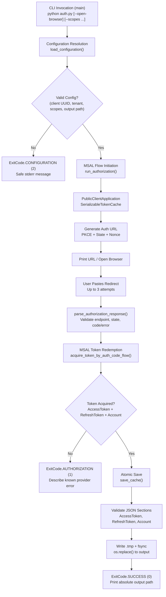

# O365 MSAL Token Cache Generator

[](https://www.python.org/downloads/)
[](LICENSE)
[](.github/workflows/checks.yml)
[](tests/)
[](requirements-lock.txt)
[](https://msal-python.readthedocs.io/)

> A public-client Microsoft 365 authentication utility that generates a reusable MSAL token cache for the `O365` Python library. It performs an interactive OAuth 2.0 authorization-code flow with PKCE, validates the native-client redirect manually, and persists an atomic, unencrypted JSON cache with strict file-system safeguards.

---

## Table of Contents

- [Title and Description](#o365-msal-token-cache-generator)
- [Table of Contents](#table-of-contents)
- [Features](#features)
- [Tech Stack & Architecture](#tech-stack--architecture)
  - [Core Languages, Frameworks, and Dependencies](#core-languages-frameworks-and-dependencies)
  - [Project Structure](#project-structure)
  - [Key Design Decisions](#key-design-decisions)
- [Getting Started](#getting-started)
  - [Prerequisites](#prerequisites)
  - [Installation](#installation)
  - [Configuration Setup](#configuration-setup)
  - [Troubleshooting Installation Issues](#troubleshooting-installation-issues)
- [Testing](#testing)
  - [Unit and Integration Tests](#unit-and-integration-tests)
  - [Linting and Formatting](#linting-and-formatting)
- [Deployment](#deployment)
- [Usage](#usage)
  - [Basic Usage](#basic-usage)
  - [Advanced Usage](#advanced-usage)
  - [Custom Formatters and Edge Cases](#custom-formatters-and-edge-cases)
- [Configuration](#configuration)
  - [Environment Variables](#environment-variables)
  - [Startup Flags](#startup-flags)
  - [Configuration File Schemas](#configuration-file-schemas)
- [License](#license)
- [Contacts & Community Support](#contacts--community-support)

---

## Features

This library provides a focused, security-hardened command-line interface for creating and persisting a Microsoft identity token cache compatible with the `O365` Python SDK. Its capabilities include, but are not limited to:

- **Public-Client Flow Only**: Operates exclusively via the OAuth 2.0 authorization-code grant with PKCE. No client secret is required or supported, aligning with desktop and native application registration models in Microsoft Entra.
- **Interactive Manual Redirect Handling**: The user pastes the complete native-client redirect URL (`https://login.microsoftonline.com/common/oauth2/nativeclient`) from their browser back into the terminal. The process retains MSAL's internal PKCE verifier and state throughout the session.
- **Atomic Cache Persistence**: Before any replacement, the serialized token payload is validated for non-empty `AccessToken`, `RefreshToken`, and `Account` sections. It is written to a same-directory temporary file (`.{filename}.{random}.tmp`), flushed with `fsync`, and published via `os.replace()` to prevent partial writes or truncated caches.
- **Credential-Safe Diagnostics**: All error reporting excludes raw MSAL exception messages, token responses, redirect URLs, provider descriptions, or arbitrary user input. Only validated OAuth error names, bounded `AADSTS` diagnostic codes (up to 5), and validated correlation UUIDs are emitted to `stderr`.
- **Strict Input Validation**: The redirect parser enforces the exact HTTPS endpoint, rejects whitespace and control characters (including `\x00`–`\x1F` and `\x7F`), rejects percent-encoding anomalies (`%(?![0-9A-Fa-f]{2})`), rejects duplicate query keys, and binds state via constant-time `hmac.compare_digest()` against the current flow.
- **Configuration Isolation**: Configuration is resolved per invocation without mutating `os.environ`. Interpolation (`${VARIABLE}`) is explicitly disabled via `dotenv_values(interpolate=False)`. Process environment variables take precedence over file values, and explicitly empty process variables are treated as hard errors rather than fallbacks.
- **Stable Exit Codes**: The executable maps all expected failures (`AuthorizationError`, `ConfigurationError`, `RequestException`, `MsalServiceError`, `OSError`, `KeyboardInterrupt`, `EOFError`) to specific integer statuses (`0`, `1`, `2`, `3`, `4`, `130`) for reliable shell scripting and CI/CD pipeline integration.
- **POSIX File Permissions**: New cache files receive mode `0600` (`rw-------`) on POSIX systems. Windows files inherit the parent directory's ACL; the utility explicitly does not attempt to translate `chmod` semantics on Windows.
- **Scope Validation**: Delegated Microsoft Graph scopes (`Mail.ReadWrite`, `Mail.Send`, `User.Read`) are validated against reserved names (`openid`, `profile`, `offline_access`). Duplicate scope arguments are deduplicated in order. Fully qualified resource URLs (`https://graph.microsoft.com/Mail.Read`) are also accepted.
- **Offline Regression Testing**: The test suite (`tests/test_auth.py`, `tests/test_msal_integration.py`) uses synthetic HTTP transport responses, temporary directories, synthetic credentials, and actual MSAL protocol methods. Real Microsoft services, real accounts, and live authorization flows are never invoked by the automated tests.
- **Dependency Pinning and Locking**: Runtime dependencies (`msal==1.39.0`, `python-dotenv==1.2.4`, `requests==2.34.2`) are pinned directly. A fully resolved transitive dependency set is maintained in `requirements-lock.txt` for reproducible builds.

> [!IMPORTANT]
> The generated `o365_token.txt` cache contains refresh tokens and is stored as unencrypted JSON. It must be kept in a private directory (e.g., user home with restricted ACLs). Never commit it to version control or share it publicly.

---

## Tech Stack & Architecture

### Core Languages, Frameworks, and Dependencies

| Component | Version / Details | Purpose |
|-----------|-------------------|---------|
| **Python** | `>=3.10` | Core runtime; validated against 3.10, 3.12, 3.14 |
| **MSAL** | `1.39.0` | Microsoft Authentication Library for Python; manages PKCE, nonce, state validation, token redemption, and the `SerializableTokenCache` schema |
| **python-dotenv** | `1.2.4` | Reads `.env` files with literal value extraction (`interpolate=False`, `encoding="utf-8-sig"`) |
| **requests** | `2.34.2` | Explicit transport dependency for `RequestException` handling within the authorization pipeline |
| **O365** (dev-only) | `2.1.10` | Interoperability dependency used by `tests/test_auth.py` to verify that generated caches load correctly via `FileSystemTokenBackend` |
| **Ruff** (dev-only) | `0.16.10` | Linter and formatter (`target-version = "py310"`, `line-length = 100`) |

> [!NOTE]
> `O365` is not a runtime dependency of `auth.py`. It is installed only when running the developer test suite (`requirements-dev.txt`) to verify backward and forward compatibility of the token cache schema.

### Project Structure

The repository follows a minimal, single-module architecture with no framework overhead. All runtime logic resides in `auth.py`; configuration, tests, dependency specifications, documentation, and CI templates are colocated at the repository root.

```
o365-msal-token-cache-generator/
├── .env.example              # Template: AZURE_CLIENT_ID, AZURE_TENANT_ID
├── .env                       # Local runtime config (ignored by Git)
├── .gitignore                 # Excludes caches, temp files, .env.*, backups
├── auth.py                    # Main executable: CLI, config, MSAL orchestration, atomic save
├── LICENSE                    # Apache License 2.0 (original text retained)
├── README.md                  # This document
├── CODE_REVIEW.md             # Detailed review findings and verification notes
├── cmd_commands.txt           # Windows setup and verification command reference
├── pyproject.toml             # Ruff lint/format rules
├── requirements.txt           # Direct runtime pins
├── requirements-lock.txt      # Fully resolved runtime dependency tree
├── requirements-dev.txt       # Runtime + Ruff + O365 (interoperability)
├── tests/
│   ├── test_auth.py           # Offline regression: config, validation, CLI, filesystem, O365 load
│   └── test_msal_integration.py  # Real MSAL protocol behavior with synthetic HTTP transport
└── .github/
    └── workflows/
        └── checks.yml         # Hosted matrix: Windows/Linux × Python 3.10/3.12/3.14
```

<details>
<summary><strong>Expanded File Tree with Line Counts and Responsibilities</strong></summary>

| File | Lines | Size | Responsibility |
|------|-------|------|--------------|
| `auth.py` | ~460 | ~18.5 KB | Configuration (`load_configuration`), CLI (`build_parser`), redirect validation (`parse_authorization_response`), authorization flow (`run_authorization`), atomic persistence (`save_cache`), status mapping (`main`) |
| `tests/test_auth.py` | ~587 | ~26.4 KB | 47 passed / 2 skipped regression scenarios covering configuration, synthetic authorization, atomic save, POSIX permissions, O365 `FileSystemTokenBackend` load, subprocess exit codes, cancellation (`EOFError`, `KeyboardInterrupt`), file-lock simulation, and symlink rejection |
| `tests/test_msal_integration.py` | ~290 | ~14 KB | Real MSAL `PublicClientApplication` construction, synthetic `auth_code_flow` initiation, `SerializableTokenCache` serialization, and `FileSystemTokenBackend` interoperability tests |
| `.env.example` | 6 | 314 B | Placeholder identifiers with comments |
| `CODE_REVIEW.md` | 154 | ~12 KB | Severity-classified findings (High, Medium, Low), architecture rationale, verification steps, practical limits, compatibility notes |

</details>

### Key Design Decisions

> [!TIP]
> The design is intentionally minimal: one executable module (`auth.py`), standard library utilities (`argparse`, `pathlib`, `urllib.parse`, `tempfile`), no framework, no database, no daemon, and no callback server.

The architecture separates six independent responsibilities within `auth.py`:

1. **Parser Construction (`build_parser`)**: Preserves backward-compatible no-argument invocation (`python auth.py`) while exposing `--env-file`, `--output`, `--scopes`, `--timeout`, and `--open-browser`.
2. **Configuration Resolution (`load_configuration`)**: Resolves settings for a single invocation only. Reads `.env` beside `auth.py` by default, or an explicitly provided file via `--env-file`. Does not search parent directories. Values are literal; no interpolation. Process variables override file values, and explicitly empty process variables (`AZURE_CLIENT_ID=`) are errors, not fallbacks.
3. **Redirect Validation (`parse_authorization_response`)**: Parses the complete native-client redirect URL. Validates endpoint (`https://login.microsoftonline.com/common/oauth2/nativeclient`), no fragment, no whitespace/control characters, no invalid percent-encoding, no duplicate keys, matching `state`, and exactly one non-empty `code` or `error`. MSAL performs its own PKCE and nonce validation afterward.
4. **MSAL Orchestration (`run_authorization`)**: Creates a `msal.SerializableTokenCache`, builds a `PublicClientApplication`, initiates an auth-code flow with `response_mode="query"`, prints the authorization URL, collects the pasted redirect (up to 3 attempts), and passes the validated response to `app.acquire_token_by_auth_code_flow()`.
5. **Atomic Persistence (`save_cache`)**: Serializes the MSAL cache, validates required sections (`AccessToken`, `RefreshToken`, `Account`), writes to a named temporary file (`.o365_token.txt.{random}.tmp`) in the same directory as the destination, flushes (`stream.flush()`), syncs (`os.fsync()`), closes, and atomically replaces (`os.replace()`). POSIX mode is set to `0o600`. The temporary file is removed in a `finally` block, with a non-fatal warning on cleanup failure.
6. **Status Mapping (`main`)**: Converts expected exceptions to integer exit codes (`ExitCode` enum) and prints safe, credential-free messages to `stderr`. Normal progress goes to `stdout`.

<details>
<summary><strong>Mermaid.js: Authorization and Persistence Pipeline</strong></summary>



</details>

> [!CAUTION]
> The redirect parser requires the exact HTTPS endpoint. A missing `https://`, an incorrect hostname (`login.microsoftonline.com`), or a non-default port will cause an `AuthorizationError`. Always copy the full URL from the browser's address bar, including the query string.

---

## Getting Started

### Prerequisites

Before installing or running this utility, verify the following prerequisites:

- **Python Interpreter**: Python `3.10` or newer (`python --version` or `python3 --version`). The project is tested on `3.10`, `3.12`, and `3.14`.
- **Internet Connectivity**: A working connection to the Microsoft identity platform (`https://login.microsoftonline.com`). The authorization flow requires live interaction with the identity server.
- **Microsoft Entra Application Registration**: A registered desktop (public client) application in the target tenant with the exact redirect URI configured:
  - `https://login.microsoftonline.com/common/oauth2/nativeclient`
- **Browser Access**: A web browser for the interactive sign-in. The browser can run on a different machine; the user only needs to copy and paste the final redirect URL back to the terminal running the generator.
- **Private Directory**: A writable, private directory for the output cache. The directory must exist before invocation (`validate_output_path` checks this); the file itself must not be a symlink or directory.

> [!WARNING]
> The default `.env` (`.env`) is optional if both `AZURE_CLIENT_ID` and `AZURE_TENANT_ID` are provided through process environment variables. However, an explicitly selected `--env-file` must exist; a missing file is a `ConfigurationError` (exit `2`).

### Installation

Clone the repository and install the pinned runtime dependencies. The commands below assume a POSIX environment (`Linux` / `macOS`); for Windows PowerShell equivalents, see the `<details>` block below.

```bash
# Clone the repository.
git clone https://github.com/adops-tool/o365-msal-token-cache-generator.git
cd o365-msal-token-cache-generator

# Create an isolated Python virtual environment.
python3 -m venv .venv

# Activate is optional; use the venv interpreter directly.
.venv/bin/python -m pip install --upgrade pip
.venv/bin/python -m pip install -r requirements-lock.txt
```

After installation, copy the example configuration file (only if `.env` does not already exist) and edit it:

```bash
# Keep an existing local configuration; do not overwrite it.
if [ ! -e .env ]; then cp .env.example .env; fi

# Edit .env in your preferred editor.
# Replace the placeholder identifiers with your actual Microsoft Entra values.
```

The `.env` file uses the following literal structure (`interpolate=False`):

```dotenv
# Copy this file to .env beside auth.py and replace both example identifiers.
# Application (client) ID from your Microsoft Entra app registration.
AZURE_CLIENT_ID=your-application-client-id
# Directory (tenant) ID; a tenant domain or a supported account alias also works.
AZURE_TENANT_ID=your-directory-tenant-id
```

> [!NOTE]
> `AZURE_CLIENT_ID` must be a valid UUID (`xxxxxxxx-xxxx-xxxx-xxxx-xxxxxxxxxxxx`). `AZURE_TENANT_ID` accepts a UUID, a domain (`contoso.onmicrosoft.com`), or one of the aliases: `common`, `organizations`, `consumers`. The registration's supported account types and tenant policies still govern which accounts can authenticate.

### Configuration Setup

After installation, configure the environment and verify it:

```bash
# Verify that the Python interpreter sees the installed packages.
.venv/bin/python -m pip check

# Verify the CLI is executable and shows the help text.
.venv/bin/python auth.py --help

# Verify the default .env is present (optional but recommended).
ls -la .env .env.example
```

Then edit `.env` with your actual identifiers. Once configured, run the generator:

```bash
.venv/bin/python auth.py --open-browser --timeout 60 --scopes User.Read Mail.Read
```

On success, the process exits with status `0` and prints the absolute path to the saved cache:

```
Success: the MSAL token cache was saved to /home/user/o365-msal-token-cache-generator/o365_token.txt.
```

### Troubleshooting Installation Issues

<details>
<summary><strong>Alternative Installation Methods, Platform Variations, and Common Problems</strong></summary>

**Windows PowerShell (without activation):**

```powershell
python -m venv .venv
.venv\Scripts\python.exe -m pip install -r requirements-lock.txt
if (-not (Test-Path -LiteralPath .env)) { Copy-Item .env.example .env }
notepad .env
.venv\Scripts\python.exe auth.py --open-browser
```

**Building from Source (development installation):**

```bash
.venv/bin/python -m pip install -r requirements-dev.txt
.venv/bin/python -m pip check
.venv/bin/python -m unittest discover -s tests -v
.venv/bin/python -m ruff check .
.venv/bin/python -m ruff format --check .
```

**Common Issues:**

| Symptom | Root Cause | Resolution |
|---------|-----------|------------|
| `ModuleNotFoundError: No module named 'msal'` | Virtual environment not activated or wrong interpreter | Use `.venv/bin/python` (POSIX) or `.venv\Scripts\python.exe` (Windows) directly |
| `Configuration error: Set AZURE_CLIENT_ID...` | `.env` missing or identifiers not replaced with UUID/domain | Copy `.env.example` to `.env` and replace placeholders |
| `Configuration error: The cache output directory must already exist.` | `--output` points to a non-existent parent directory | Create the parent directory first (`mkdir -p output/`) or use the default (`o365_token.txt`) |
| `PermissionError` on `.env` or `.env.*` | File permissions or SELinux/AppArmor restrictions | Check `chmod 644 .env` and directory ACLs; ensure the directory is private |
| `UnicodeDecodeError` when reading `.env` | File saved with an unsupported encoding or BOM | Save `.env` as UTF-8 (`utf-8-sig`) without a BOM, or with BOM (supported) |

> [!TIP]
> The `.env` file supports an optional UTF-8 BOM (`\ufeff`). The `python-dotenv` loader (`encoding="utf-8-sig"`) handles it transparently. Avoid non-UTF-8 encodings such as `latin-1` or `cp1252`.

</details>

---

## Testing

The project includes an offline regression test suite that exercises real MSAL protocol behavior, file-system atomic-save logic, configuration validation, and `O365` interoperability. All tests use temporary directories and synthetic credentials; no live Microsoft identity service or real account is contacted.

### Unit and Integration Tests

Run the full suite from the repository root using the development environment:

```bash
# Install developer dependencies (runtime + Ruff + O365 interoperability).
.venv/bin/python -m pip install -r requirements-dev.txt

# Execute the complete test suite with verbose output.
.venv/bin/python -m unittest discover -s tests -v
```

Expected results (as verified during the 2026-10-06 code review):

- **Discovered**: 49 tests
- **Passed**: 47
- **Skipped**: 2 (POSIX-specific filesystem capabilities unavailable on the host, such as symlink creation or exact `chmod` semantics)

Individual test categories:

```bash
# Run only the main regression suite (configuration, CLI, atomic save, O365 load).
.venv/bin/python -m unittest tests.test_auth -v

# Run only the MSAL integration suite (real MSAL methods with synthetic transport).
.venv/bin/python -m unittest tests.test_msal_integration -v

# Run a specific test class (e.g., ConfigurationTests).
.venv/bin/python -m unittest tests.test_auth.ConfigurationTests -v
```

### Linting and Formatting

The project uses `ruff` (`target-version = "py310"`, `line-length = 100`) for static analysis. Per-file exceptions are configured in `pyproject.toml` (e.g., `auth.py` excludes `E501` for single-string diagnostic messages).

```bash
# Check all Python source files for lint errors (E, F, I, B, UP rules).
.venv/bin/python -m ruff check .

# Check that all files conform to the formatting rules.
.venv/bin/python -m ruff format --check .

# Auto-format source files (use after code changes, before committing).
.venv/bin/python -m ruff format .
```

> [!NOTE]
> The `.ruff_cache/` directory and `.review-backup/` directory are excluded via `pyproject.toml` (`extend-exclude`) to prevent linting generated files or original-file backups from the review process.

---

## Deployment

This tool is intended as a developer-side authentication utility rather than a long-running production service. However, it can be integrated into CI/CD pipelines, container images, or scheduled jobs under controlled conditions.

### Production Deployment Guidelines

1. **Build Artifacts**: The runtime does not require a compiled binary. Package the source with pinned dependencies (`requirements-lock.txt`) in a container image or virtual environment.

2. **Containerization Example** (`Dockerfile` concept):

```dockerfile
FROM python:3.14-slim
WORKDIR /app
COPY requirements-lock.txt .
RUN pip install --no-cache-dir -r requirements-lock.txt
COPY auth.py .env.example ./
COPY .env ./  # In production, mount .env via secrets, not COPY.
ENTRYPOINT ["python", "auth.py"]
```

> [!IMPORTANT]
> Never embed `.env` or generated `o365_token.txt` files into container images. Mount the configuration via Docker secrets (`docker secret`), Kubernetes `Secret`, or environment variables. Mount the output directory as a persistent volume (`docker run -v token_cache:/app`) if the cache must survive container restarts.

3. **CI/CD Pipeline Integration**: Because the authorization flow is interactive (requires a browser and manual redirect pasting), fully automated CI deployment is not supported. The pipeline can:
   - Verify dependency installation (`pip install -r requirements-lock.txt`, `pip check`).
   - Run the offline test suite (`unittest discover -s tests -v`).
   - Execute lint and format checks (`ruff check .`, `ruff format --check .`).
   - Build a container image for manual or scheduled interactive use.

4. **Scheduled Execution**: The generator produces a new cache; it does not refresh an existing token automatically. A scheduled job (e.g., `cron`) can invoke the tool, but the interactive redirect step requires either:
   - A persistent terminal session with the process kept alive during sign-in, or
   - A separate manual run to generate a fresh cache, which is then copied to the scheduled environment.

> [!CAUTION]
> The process status (`sys.exit(main())`) determines whether a script continues. A non-zero exit (`1` authorization failure, `2` configuration error, `3` network failure, `4` storage error, `130` cancellation) must be handled explicitly in any calling automation. The previous cache is preserved on failure, but a failed run does not guarantee permanent unattended access.

---

## Usage

### Basic Usage

The simplest invocation requires no arguments if `.env` is configured with valid identifiers:

```python
# In Python (programmatic invocation), supply an explicit argument list.
# This avoids inheriting unrelated command-line arguments from a parent process.
import auth

status = auth.main([])
if status == auth.ExitCode.SUCCESS:
    print("Cache generated successfully.")
else:
    print(f"Generation failed with status: {status}")
```

From the terminal:

```bash
# Basic invocation using the default .env and default output (o365_token.txt).
.venv/bin/python auth.py

# Open the authorization URL automatically in the default browser.
.venv/bin/python auth.py --open-browser

# Request a reduced scope set (read-only mail access, no sending, no full profile).
.venv/bin/python auth.py --scopes User.Read Mail.Read

# Use a custom environment file (e.g., for production tenant isolation).
.venv/bin/python auth.py --env-file .env.production --output service_token.txt

# Extend the network timeout for slow or high-latency connections.
.venv/bin/python auth.py --timeout 120
```

The interactive flow proceeds as follows:

1. The tool prints the authorization URL (`auth_uri`) to `stdout`.
2. The user opens the URL in their browser, signs in, and approves the requested delegated permissions.
3. The browser redirects to the native-client endpoint (`https://login.microsoftonline.com/common/oauth2/nativeclient`). The page may appear blank; the response is in the address bar.
4. The user copies the complete redirect URL (including the query string `?code=...&state=...`) and pastes it into the terminal.
5. The generator validates the redirect, passes it to MSAL, saves the atomic cache, and prints the absolute output path.

> [!NOTE]
> Keep the original terminal process running throughout sign-in. MSAL's PKCE verifier and flow state live in that process's memory. A redirect URL copied from a previous session (or a restarted process) will fail with `State mismatch` (exit `1`).

### Advanced Usage

<details>
<summary><strong>Custom Formatters, Multi-Tenant Deployments, Programmatic Invocation, and Subprocess Integration</strong></summary>

**Custom Scope Combinations and Fully Qualified Resource URLs:**

```python
# Fully qualified Graph resource URLs are also accepted by the scope parser.
scopes = [
    "https://graph.microsoft.com/User.Read",
    "https://graph.microsoft.com/Mail.ReadWrite",
    "https://graph.microsoft.com/Mail.Send",
]
```

**Programmatic Invocation with Custom Arguments:**

```python
import argparse
import auth

parser = auth.build_parser()
args = parser.parse_args([
    "--env-file", ".env.staging",
    "--output", "/secure/path/staging_token.txt",
    "--scopes", "User.Read", "Mail.Read",
    "--timeout", "60",
    "--open-browser",
])

# The main() function resolves configuration, runs authorization,
# and returns the integer ExitCode. Always check the return value.
exit_code = auth.main(args=[
    "--env-file", ".env.staging",
    "--output", "/secure/path/staging_token.txt",
    "--scopes", "User.Read", "Mail.Read",
    "--timeout", "60",
    "--open-browser",
])
```

> [!WARNING]
> Do not call `auth.load_configuration()` or `auth.run_authorization()` in isolation without understanding the exception contract. `load_configuration()` raises `ConfigurationError`; `run_authorization()` raises `AuthorizationError`, `RequestException`, or `MsalServiceError`. `main()` catches all of these and maps them to safe stderr output and integer exit codes.

**Multi-Tenant and Alias Configurations:**

```dotenv
# .env.production - production tenant (domain alias supported)
AZURE_CLIENT_ID=11111111-1111-1111-1111-111111111111
AZURE_TENANT_ID=contoso.onmicrosoft.com
```

```bash
.venv/bin/python auth.py --env-file .env.production --output production/o365_token.txt
```

**Subprocess Integration in Shell Scripts:**

```bash
#!/bin/bash
set -euo pipefail

.venv/bin/python auth.py --env-file .env --output /secure/o365_token.txt
if [ $? -eq 0 ]; then
    echo "Cache generated at $(realpath /secure/o365_token.txt)"
else
    echo "Token generation failed. Check stderr for details." >&2
    exit 1
fi
```

**Using the Cache with the `O365` Library (Verified Interoperability):**

```python
"""Load an existing MSAL token cache generated by auth.py into an O365 Account."""
from pathlib import Path

from O365 import Account
from O365.utils.token import FileSystemTokenBackend

client_id = "your-application-client-id"  # Same UUID used by auth.py
client_tenant = "your-directory-tenant-id"  # Same UUID/domain used by auth.py
cache_file = Path("o365_token.txt").resolve()

# Initialize the token backend pointing at the same file name.
backend = FileSystemTokenBackend(
    token_path=cache_file.parent,
    token_filename=cache_file.name,
)

# Create the public-client account using the same identifiers.
account = Account(
    client_id,
    auth_flow_type="public",
    tenant_id=client_tenant,
    token_backend=backend,
)

# Verify that a reusable local cache exists. This does not prove that
# Microsoft will accept a future refresh token (revocation and tenant
# policies are evaluated by the identity service, not this tool).
if not account.is_authenticated:
    raise RuntimeError(
        "No reusable local cache was found. Run auth.py to generate a fresh cache."
    )

# After authentication, the account can perform Microsoft Graph operations.
# O365 will initiate token refresh through MSAL when the access token expires,
# provided the cache file remains writable.
```

</details>

### Custom Formatters and Edge Cases

<details>
<summary><strong>Redirect Parser Edge Cases, Cache Validation Failures, Concurrent Write Scenarios, and Cancellation Handling</strong></summary>

**Edge Cases in Redirect Validation:**

- **Duplicate Keys**: A redirect URL containing `?code=ABC&code=DEF` (duplicate `code`) raises `AuthorizationError` (`The redirect query contains empty or duplicate parameters.`). MSAL's flow also requires a single unambiguous authorization response.
- **Empty Values**: `?code=` or `?state=` (empty `code` or empty `state`) raises `AuthorizationError` (`The authorization code or error value is empty.` or `The redirect state does not match this sign-in.`).
- **Fragment Errors**: A URL with a fragment (`#fragment`) is rejected by the endpoint parser (`not parsed.fragment`). MSAL uses `response_mode="query"`; fragments are not expected in this workflow.
- **State Mismatch**: A redirect URL with a `state` value from a previous or different flow fails `hmac.compare_digest()`. The error message (`The redirect state does not match this sign-in. Use the current browser flow.`) does not reveal the expected or received state value.
- **Percent-Encoding Errors**: Invalid percent-encoding (`%` not followed by two hex digits) raises `ValueError` and results in `Paste the complete Microsoft native-client redirect URL, including its query.`
- **Length Limits**: URLs exceeding `16,384` characters (`MAX_REDIRECT_LENGTH`) are rejected before parsing (`Paste a complete redirect URL of at most 16,384 characters.`).

**Cache Validation Failures (`save_cache`):**

Before writing any temporary file, `save_cache()` validates:

```python
payload = json.loads(serialized)
if not isinstance(payload, dict) or any(
    not isinstance(payload.get(section), dict) or not payload[section]
    for section in ("AccessToken", "RefreshToken", "Account")
):
    raise AuthorizationError("MSAL did not produce a reusable account and token cache. Sign in again.")
```

If MSAL produces an incomplete or invalid serialized cache (e.g., missing `RefreshToken`), the temporary file is never created, and the existing cache (if any) remains untouched.

**Concurrent Write Scenarios:**

The atomic `os.replace()` protects against partial application writes but is **not** an inter-process lock. Running two `auth.py` instances simultaneously that write to the same `--output` path is unsupported. Concurrent writes to the same file may result in one replacement winning over the other, or in a temporary file collision (though `tempfile.NamedTemporaryFile` uses random names to minimize this).

> [!WARNING]
> Avoid writing one cache file from multiple concurrent generator processes. Use separate output paths for concurrent sign-ins, or serialize the workflow at the application layer.

**Cancellation Handling:**

The user can cancel the interactive sign-in at any time with `Ctrl+C` (`KeyboardInterrupt`). The process exits with status `130` (`ExitCode.CANCELLED`) and prints `\nAuthorization cancelled by the user.` to `stderr`. If cancellation occurs before any temporary file is created, the previous cache (if present) remains intact. The `finally` block in `save_cache()` attempts to remove any partially created temporary file.

**Input Stream Ending (`EOFError`):**

If `sys.stdin` reaches end-of-file before a redirect URL is pasted (e.g., running in a non-interactive pipeline without redirect input), the process exits with status `1` (`ExitCode.AUTHORIZATION`) and prints `Authorization cancelled: no redirect URL was provided on standard input.`

</details>

---

## Configuration

Configuration is resolved independently for each invocation. It is never loaded at import time, ensuring that importing `auth` as a module does not trigger network requests, file reads (other than the optional `.env`), or environment mutations.

### Environment Variables

The following environment variables override `.env` file values. Explicitly empty values (`AZURE_CLIENT_ID=`) are errors, not fallbacks.

| Variable | Type | Description | Validation Rules |
|----------|------|-------------|-------------------|
| `AZURE_CLIENT_ID` | UUID string (`xxxxxxxx-xxxx-xxxx-xxxx-xxxxxxxxxxxx`) | Microsoft Entra application (client) ID for the public client | Must parse as a valid UUID via `uuid.UUID()`. Invalid UUIDs result in `ConfigurationError`. |
| `AZURE_TENANT_ID` | UUID, domain, or alias (`common`, `organizations`, `consumers`) | Directory (tenant) identifier or public endpoint alias | Must be a valid UUID, a valid domain (`contoso.onmicrosoft.com`), or one of the three aliases. Invalid values result in `ConfigurationError`. |

> [!NOTE]
> Process environment variables take precedence over file values. If both `.env` and the process environment define the same variable, the process value is used. There is no interpolation (`interpolate=False`), so a value of `AZURE_CLIENT_ID=${OTHER_ID}` is treated as a literal string and will fail UUID validation.

### Startup Flags

The CLI is built with Python's `argparse`. All flags are optional and have documented defaults.

| Flag | Default | Type | Description |
|------|---------|------|-------------|
| `--env-file` | `.env` beside `auth.py` (`Path(__file__).resolve().with_name(".env")`) | `Path` | Explicit configuration file path. The file must exist (`is_file()`). Relative paths are resolved against the current working directory, not the script's directory (unless the default is used). |
| `--output` | `Path("o365_token.txt")` (current working directory) | `Path` | Destination file for the serialized MSAL cache. The parent directory must exist (`path.parent.is_dir()`). Relative paths remain relative to the CWD. |
| `--scopes` | `Mail.ReadWrite`, `Mail.Send`, `User.Read` | `str` (one or more) | Delegated Microsoft Graph permission names. Fully qualified URLs (`https://graph.microsoft.com/Mail.ReadWrite`) are also accepted. Reserved scopes (`openid`, `profile`, `offline_access`) are rejected. |
| `--timeout` | `30.0` (seconds) | `float` | Positive, finite timeout applied to MSAL's internal network operations (`timeout=config.timeout`). This bounds individual connect/read waits; it does not bound the total interactive sign-in duration. |
| `--open-browser` | Disabled (`False`) | Boolean (`store_true`) | Attempts to open the authorization URL automatically using `webbrowser.open()`. If the browser cannot be opened (e.g., no `DISPLAY` on headless servers), the URL is still printed to `stdout`. |

> [!TIP]
> For non-interactive or headless environments (e.g., CI containers, remote servers), omit `--open-browser`. The authorization URL will be printed to `stdout`, and the user (or an operator) can access it from another machine.

### Configuration File Schemas

<details>
<summary><strong>Full Default `.env` Schema, `.env` Variants, and Validation Behavior</strong></summary>

**Standard `.env` Schema:**

```dotenv
# File: .env
# Encoding: UTF-8 (optional BOM supported)
# Interpolation: Disabled (${...} is literal, not expanded)
# Line endings: Unix (LF) or Windows (CRLF) — both accepted by dotenv

# Required: Application (client) ID
AZURE_CLIENT_ID=11111111-1111-1111-1111-111111111111

# Required: Directory (tenant) ID or alias
AZURE_TENANT_ID=22222222-2222-2222-2222-222222222222
# Alternative aliases: common | organizations | consumers
# Alternative formats: contoso.onmicrosoft.com (domain) | 33333333-... (UUID)
```

**Production `.env` Example (`.env.production`):**

```dotenv
AZURE_CLIENT_ID=aaaaaaaa-aaaa-aaaa-aaaa-aaaaaaaaaaaa
AZURE_TENANT_ID=production-tenant.onmicrosoft.com
```

**Validation Behavior (Detailed):**

1. **File Reading**: `dotenv_values(env_file, encoding="utf-8-sig", interpolate=False)` reads the file. If the file does not exist and `--env-file` was not explicitly provided (`None`), the default `.env` is skipped (`values = {}`). If `--env-file` was explicitly provided (`not None`) and the file is missing, a `ConfigurationError` is raised.
2. **Literal Extraction**: Values are treated as literal strings. No variable substitution is performed. If `.env` contains `AZURE_CLIENT_ID=${REAL_ID}`, the parsed value is the literal string `${REAL_ID}`, which will fail UUID validation.
3. **Process Precedence**: For each variable (`AZURE_CLIENT_ID`, `AZURE_TENANT_ID`):
   - `os.environ.get("VAR", values.get("VAR"))` is evaluated.
   - If the process variable exists (even as an empty string), its value is used.
   - An explicitly empty process variable (`AZURE_CLIENT_ID=`) yields `""` after `.strip()`, which triggers the `if not client_id or not tenant_id:` error (`Set AZURE_CLIENT_ID and AZURE_TENANT_ID...`).
4. **UUID Parsing (`client_id`)**: `str(UUID(client_id))` validates the format. If parsing fails, `ConfigurationError` is raised with the message `AZURE_CLIENT_ID must be an application UUID.`
5. **Tenant Parsing (`tenant_id`)**: `str(UUID(tenant_id))` is attempted first. If that fails, a domain regex (`(?=.{1,253}\Z)(?:[A-Za-z0-9](?:[A-Za-z0-9-]{0,61}[A-Za-z0-9])?\.)+[A-Za-z](?:[A-Za-z0-9-]{0,61}[A-Za-z0-9])?`) is applied. If neither UUID, domain, nor alias (`common`, `organizations`, `consumers`) matches, `ConfigurationError` is raised (`AZURE_TENANT_ID must be a tenant UUID, domain, common, organizations, or consumers.`).
6. **Scope Validation** (`scopes`): Each scope is stripped of the optional `https://graph.microsoft.com/` prefix for reserved-scope checking. The name must match `[A-Za-z][A-Za-z0-9]*(?:\.[A-Za-z][A-Za-z0-9]*)+`. Reserved names (`openid`, `profile`, `offline_access`) are rejected. Empty scope lists (`[]`) are rejected.

**Configuration File Variants:**

| Variant | Filename Pattern | Use Case | Notes |
|---------|------------------|----------|-------|
| Default | `.env` | Development | Resolved automatically by `auth.py` (`DEFAULT_ENV_FILE`) |
| Explicit | `--env-file .env.staging` | Staging / CI | Must exist (`is_file()`); does not fall back to `.env` |
| Production | `.env.production` | Production isolation | Same validation rules apply |
| Multiple | `.env.local`, `.env.ci`, etc. | Multi-environment workflows | Each file must be referenced explicitly with `--env-file` |

> [!CAUTION]
> The `.env` file and any `.env.*` files (except `.env.example`) are excluded from version control via `.gitignore`. If a `.env` file is accidentally committed and then removed, its contents may remain in Git history. Never commit real identifiers or token caches.

</details>

---

## License

This project is licensed under the **Apache License, Version 2.0**.

The full license text is retained unchanged in the [`LICENSE`](LICENSE) file. Key terms include:

- **Grant of Copyright License**: Perpetual, worldwide, non-exclusive, no-charge, royalty-free, irrevocable.
- **Grant of Patent License**: Applies only to patent claims licensable by each Contributor.
- **Redistribution**: You may reproduce and distribute copies in Source or Object form, with or without modifications, provided you retain copyright, patent, trademark, and attribution notices, include a copy of the License, and mark any modified files prominently.
- **Disclaimer of Warranty**: The Work is provided on an "AS IS" basis, without warranties of any kind, including but not limited to non-infringement, merchantability, or fitness for a particular purpose.
- **Limitation of Liability**: No Contributor is liable for any damages arising from the use or inability to use the Work.

For the complete legal text, refer to the [`LICENSE`](LICENSE) file or visit the [Apache License 2.0 official site](http://www.apache.org/licenses/LICENSE-2.0).

> [!NOTE]
> The original copyright attribution (`Copyright 2025 adops-tool`) and repository links (`https://github.com/adops-tool/o365-msal-token-cache-generator`, original gist reference) are retained in the source and documentation. This README expands upon the original documentation without altering the underlying license terms.

---

## Contacts & Community Support

If you find this tool useful, consider leaving a star on the repository or supporting the author directly.

## Support the Project

[](https://devs-in-exile.pages.dev/)
[](https://www.patreon.com/OstinFCT)
[](https://ko-fi.com/fctostin)
[](https://boosty.to/ostinfct)
[](https://www.youtube.com/@FCT-Ostin)
[](https://t.me/FCTostin)

If you find this tool useful, consider leaving a star on GitHub or supporting the author directly.
