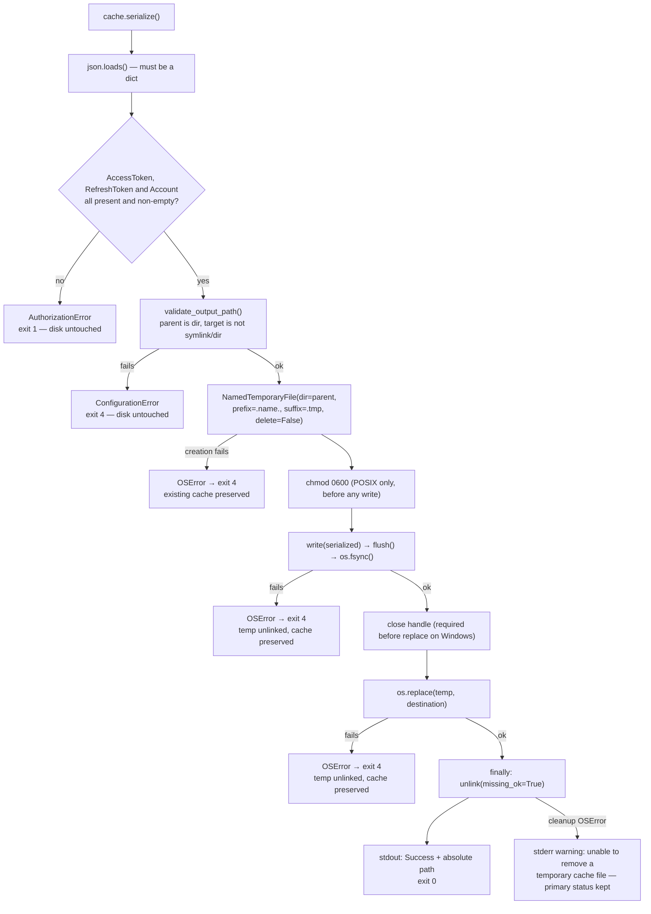
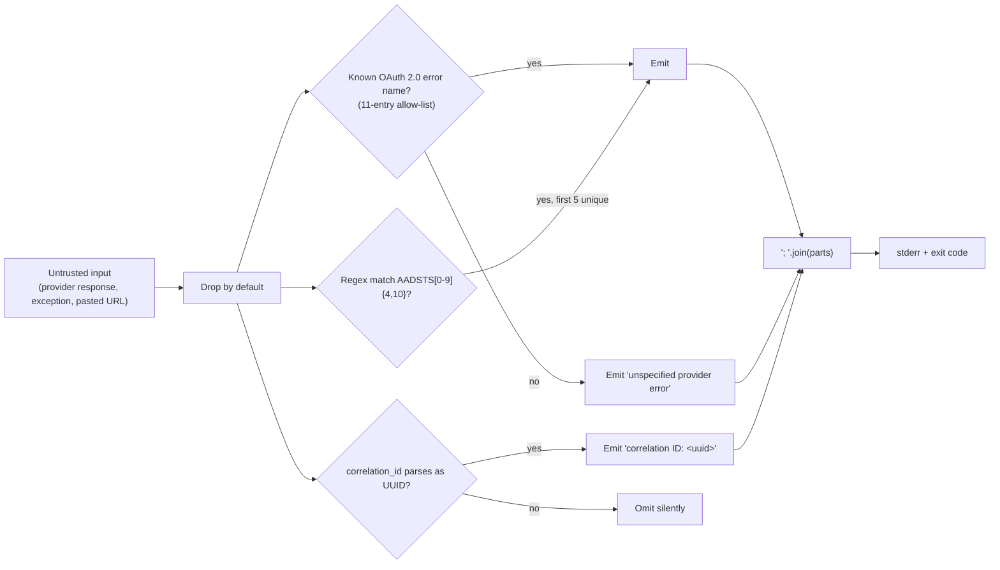
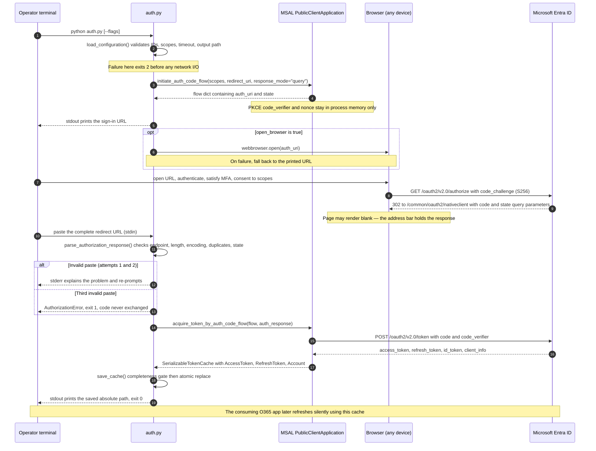
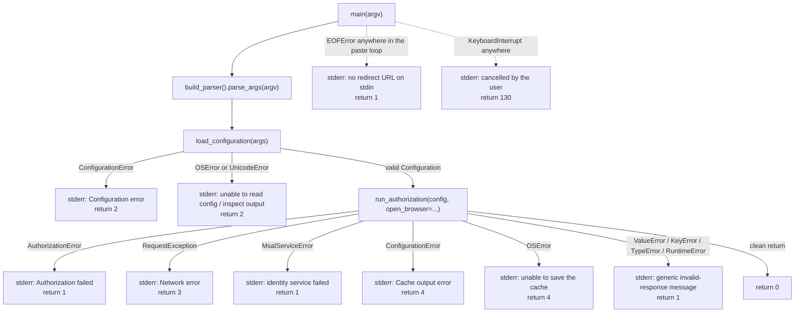

<div align="center">

# O365 MSAL Token Cache Generator

**A dependency-light Python CLI that completes an interactive Microsoft Entra public-client (PKCE) sign-in exactly once and persists a durable, atomically written MSAL token cache that O365-based applications can consume headlessly — with no client secret, no callback listener, and no browser on the host.**

[](LICENSE)
[](#prerequisites)
[](https://github.com/adops-tool/o365-msal-token-cache-generator/actions/workflows/checks.yml)
[](#testing)
[](#what-is-covered)
[](https://docs.astral.sh/ruff/)
[](https://msal-python.readthedocs.io/en/stable/)
[](#prerequisites)

<sub>The build badge activates once `.github/workflows/checks.yml` is committed — see
[CI/CD Integration](#cicd-integration). The suite currently passes locally: 49/49
tests, Ruff lint and format clean, `pip check` clean.</sub>

</div>

---

## Table of Contents

- [Overview](#overview)
- [Features](#features)
- [Tech Stack & Architecture](#tech-stack--architecture)
  - [Runtime and Toolchain](#runtime-and-toolchain)
  - [Dependency Matrix](#dependency-matrix)
  - [Project Structure](#project-structure)
  - [Key Design Decisions](#key-design-decisions)
  - [Diagnostics and Output Pipeline](#diagnostics-and-output-pipeline)
  - [Authorization Flow](#authorization-flow)
- [Getting Started](#getting-started)
  - [Prerequisites](#prerequisites)
  - [Microsoft Entra App Registration](#microsoft-entra-app-registration)
  - [Installation](#installation)
  - [First Run](#first-run)
- [Testing](#testing)
  - [Running the Suite](#running-the-suite)
  - [What Is Covered](#what-is-covered)
  - [Verified Results](#verified-results)
  - [Linting and Formatting](#linting-and-formatting)
- [Deployment](#deployment)
  - [Deployment Model](#deployment-model)
  - [Containerization](#containerization)
  - [CI/CD Integration](#cicd-integration)
  - [Scheduled Regeneration](#scheduled-regeneration)
  - [Dependency Auditing and Upgrades](#dependency-auditing-and-upgrades)
  - [Production Readiness Checklist](#production-readiness-checklist)
- [Usage](#usage)
  - [Basic Usage](#basic-usage)
  - [Consuming the Cache with O365](#consuming-the-cache-with-o365)
  - [Advanced Usage](#advanced-usage)
  - [Custom Diagnostics Formatting](#custom-diagnostics-formatting)
  - [Edge Cases and Failure Modes](#edge-cases-and-failure-modes)
- [Configuration](#configuration)
  - [Environment Variables](#environment-variables)
  - [Command-Line Options](#command-line-options)
  - [Resolution Rules and Precedence](#resolution-rules-and-precedence)
  - [Application Constants](#application-constants)
  - [Repository Hygiene](#repository-hygiene)
- [License](#license)
- [Contacts & Community Support](#contacts--community-support)
  - [Support the Project](#support-the-project)

---

## Overview

`o365-msal-token-cache-generator` is a single-module Python command-line utility
(`auth.py`) that solves one narrow problem well: **bootstrap a reusable MSAL token
cache for a Microsoft 365 (Graph) integration without storing a client secret and
without running an HTTP callback server.**

The operator signs in through any browser — including a browser on a completely
different machine — copies the final `nativeclient` redirect URL out of the address
bar, and pastes it back into the waiting terminal. The tool validates that response,
hands it to the Microsoft Authentication Library (MSAL) for the one-time code
exchange, verifies that the resulting cache is actually reusable, and publishes it to
disk with an atomic, `fsync`-backed replacement. Downstream applications (typically
[`O365`](https://github.com/O365/python-o365)) then load that file and perform their
own silent refreshes.

> [!IMPORTANT]
> This tool **creates** the cache. It is not a token broker, a daemon, or a session
> manager. Your consuming application is responsible for loading the cache, using it,
> and persisting subsequent refreshes back to the same writable location.

> [!CAUTION]
> The generated `o365_token.txt` is **plaintext JSON containing refresh tokens** —
> bearer credentials that grant delegated access to the signed-in user's mailbox and
> profile. Treat it with the same care as a password: store it in a private directory,
> never commit it, never paste it into an issue tracker, and rotate it if it leaks.

---

## Features

**Authentication model**

- **Public client, zero secrets.** Uses `msal.PublicClientApplication` with the
  OAuth 2.0 Authorization Code + PKCE flow. No client secret, no certificate, and no
  key material is stored on disk or in configuration.
- **No local callback listener.** The redirect target is Microsoft's own
  `https://login.microsoftonline.com/common/oauth2/nativeclient` page, so the tool
  binds no TCP port, opens no firewall rule, and starts no web server. This makes it
  usable over SSH, RDP, inside containers, on jump hosts, and behind strict host
  firewalls.
- **Browser location independence.** Sign-in can happen on a laptop, a phone, or a
  second workstation; only the final URL text needs to reach the terminal.
- **MSAL owns the protocol.** PKCE `code_verifier`/`code_challenge` (S256), `state`,
  `nonce` validation, authority/instance discovery, token redemption, and the
  serialized cache schema are all delegated to the SDK. The flow object — including
  the PKCE verifier — lives only in process memory and is never written to disk.
- **Reserved scopes handled for you.** `openid`, `profile`, and `offline_access` are
  injected by MSAL and are *rejected* if supplied explicitly, preventing the common
  misconfiguration that yields a cache without refresh tokens.

**Operator experience**

- **Backwards-compatible no-argument invocation.** `python auth.py` still works
  exactly as before; every new behavior is opt-in through flags.
- **Three paste attempts.** A malformed or truncated paste is re-prompted locally
  without consuming the single-use authorization code. The code is exchanged at most
  once per run, and the tool never auto-retries an exchange.
- **Optional automatic browser launch.** `--open-browser` attempts
  `webbrowser.open()` and degrades gracefully to the printed URL when no browser is
  available (headless servers, containers, WSL without a browser).
- **Copy-pasteable, self-explaining prompts.** Instructions go to stdout; every
  diagnostic, warning, and error goes to stderr, so `python auth.py > run.log` still
  shows you the errors live.
- **Deterministic exit codes.** `0/1/2/3/4/130` distinguish success, authorization
  failure, configuration failure, network failure, storage failure, and user
  cancellation — suitable for shell conditionals, schedulers, and alerting.

**Input validation (fail closed)**

- **Strict identifier validation.** `AZURE_CLIENT_ID` must parse as a UUID;
  `AZURE_TENANT_ID` must be a tenant UUID, an RFC-1035-style tenant domain (≤253
  characters, length-limited labels), or one of `common`, `organizations`,
  `consumers`. Placeholder text, names, and URL fragments are rejected before any
  network call.
- **Scope grammar enforcement.** Each scope must match
  `[A-Za-z][A-Za-z0-9]*(\.[A-Za-z][A-Za-z0-9]*)+` (dotted Graph permission names),
  with or without the `https://graph.microsoft.com/` resource prefix. Duplicates are
  removed while preserving order.
- **Hardened redirect-URL parser.** Requires the exact `https` scheme, the
  `login.microsoftonline.com` host, port `443`/default, no embedded userinfo, the
  exact `/common/oauth2/nativeclient` path, and **no fragment**. Rejects control
  characters and whitespace, malformed percent-encodings, more than 30 query fields,
  URLs longer than 16,384 characters, duplicate or empty query keys, and any response
  that does not carry exactly one non-empty `code` **or** `error` parameter.
- **Constant-time state comparison.** `hmac.compare_digest` over UTF-8 *bytes* (not
  `str`, which would raise on non-ASCII input) binds the pasted response to the
  current process's flow and defeats trivial timing side channels.
- **Finite, positive network timeout.** `--timeout` is validated with
  `math.isfinite`, rejecting `nan`, `inf`, zero, and negative values before MSAL is
  constructed.
- **Destination guards.** The output parent directory must already exist; the output
  path must not be a symlink, a directory, or other non-regular file; and it must not
  resolve to the configuration file being read.

**Credential-safe diagnostics**

- **No secret echo.** Pasted redirect URLs, raw exception strings, token responses,
  MSAL `state`/`nonce` mismatch details, and arbitrary provider `error_description`
  text are never printed. MSAL's own `ValueError` for a state mismatch embeds both
  state values, so it is caught and replaced with a generic message.
- **Allow-listed provider detail.** Only a known OAuth 2.0 error name (from an
  11-entry allow-list), up to five distinct `AADSTSnnnnn` codes extracted by regex,
  and a correlation ID that re-parses as a UUID reach the console.
- **Terminal-injection resistant.** Untrusted provider strings are dropped rather
  than sanitized, eliminating ANSI escape-sequence smuggling into operator terminals
  and CI logs.

**Durability and storage**

- **Completeness gate before any disk write.** The serialized cache must contain
  non-empty `AccessToken`, `RefreshToken`, **and** `Account` dictionaries, or the run
  fails with exit `1` and the previous file is left untouched.
- **Atomic publish.** Write to a same-directory temporary file
  (`.o365_token.txt.<random>.tmp`) → `flush()` → `os.fsync()` → close →
  `os.replace()`. A crash, a full disk, or a permission error at any earlier step
  preserves the existing usable cache.
- **POSIX permissions.** On non-Windows systems the temporary file is `chmod 0600`
  *before* the credential bytes are written, so no world-readable window exists.
- **Best-effort cleanup.** Temporary files are unlinked in a `finally` block; a
  cleanup failure emits a warning to stderr instead of masking the primary error.
- **Windows-correct replacement.** `NamedTemporaryFile(delete=False)` is closed
  before `os.replace`, which is mandatory on Windows; the temp file lives beside the
  target to avoid cross-volume moves.

**Configuration**

- **No import-time side effects.** Importing `auth` performs no file I/O, no
  environment mutation, and no network access; configuration is resolved inside
  `main()`, so every invocation sees fresh settings and the module is safely testable.
- **Predictable `.env` discovery.** The default file is `.env` **beside `auth.py`**
  (`Path(__file__).resolve().with_name(".env")`) — parent directories are never
  searched, and the default file is optional when both identifiers come from the
  process environment.
- **Explicit precedence.** Process environment variables override file values, and an
  explicitly empty process variable is a configuration *error* rather than a silent
  fallback to the file.
- **Literal values only.** `python-dotenv` interpolation is disabled
  (`interpolate=False`), so an unrelated `${SOME_VAR}` in your environment can never
  silently rewrite an application identifier.
- **Encoding tolerance.** Files are read as `utf-8-sig`, transparently handling a
  UTF-8 BOM (common with Windows editors and PowerShell redirection) plus surrounding
  whitespace.

**Engineering**

- **Fully pinned dependency sets.** `requirements.txt` pins the three direct runtime
  dependencies; `requirements-lock.txt` pins all eleven reviewed runtime packages
  (direct + transitive) for reproducible installs.
- **49 offline tests, zero network calls.** The suite exercises configuration,
  redirect validation, storage failure modes, CLI orchestration, cancellation, real
  MSAL PKCE/nonce behavior over a synthetic HTTP transport, and real O365 cache
  loading. Tests never read your `.env`, never touch a real cache, and never contact
  Microsoft.
- **Consistent style enforcement.** Ruff (`E`, `F`, `I`, `B`, `UP`) at
  `target-version = "py310"`, `line-length = 100`, with a narrow `E501` exemption for
  `auth.py`'s single-string, credential-safe CLI messages.
- **Cross-platform, cross-version.** Verified against Python 3.10 / 3.12 / 3.14 on
  Windows and Linux; macOS follows the POSIX code paths.
- **Deliberately minimal architecture.** No framework, no database, no daemon, no
  plugin system, no client secret, and only three direct runtime dependencies.

---

## Tech Stack & Architecture

### Runtime and Toolchain

| Layer | Choice | Version | Role |
| --- | --- | --- | --- |
| Language | Python | **3.10+** (validated on 3.10 / 3.12 / 3.14) | `from __future__ import annotations`, PEP 604 unions, `dataclasses`, `IntEnum` |
| Auth SDK | [`msal`](https://pypi.org/project/msal/) | `1.39.0` | PKCE, state/nonce, authority discovery, token exchange, cache schema |
| Config | [`python-dotenv`](https://pypi.org/project/python-dotenv/) | `1.2.4` | `dotenv_values()` file parsing only — `os.environ` is never mutated |
| Transport | [`requests`](https://pypi.org/project/requests/) | `2.34.2` | Declared explicitly because `auth.py` catches `RequestException` directly |
| Interop (dev) | [`O365`](https://pypi.org/project/O365/) | `2.1.10` | Offline verification that the emitted cache schema loads in a real consumer |
| Lint/format (dev) | [`ruff`](https://docs.astral.sh/ruff/) | `0.16.10` | Linter and formatter, configured in `pyproject.toml` |
| Test runner | `unittest` (stdlib) | — | `python -m unittest discover -s tests` |
| Stdlib surface | `argparse`, `hmac`, `json`, `math`, `os`, `re`, `sys`, `tempfile`, `webbrowser`, `dataclasses`, `enum`, `pathlib`, `typing`, `urllib.parse`, `uuid` | — | CLI, validation, constant-time compare, atomic filesystem operations |

### Dependency Matrix

Direct runtime dependencies are pinned in `requirements.txt`. Transitive packages are
still resolved by pip unless you install from `requirements-lock.txt`, which contains
the full reviewed set.

| Package | Pinned | Purpose | License |
| --- | --- | --- | --- |
| `msal` | `1.39.0` | OAuth 2.0 / OpenID Connect client for the Microsoft identity platform | MIT |
| `python-dotenv` | `1.2.4` | `.env` parsing with interpolation disabled | BSD-3-Clause |
| `requests` | `2.34.2` | HTTP transport used by MSAL; exception types handled explicitly | Apache-2.0 |

<details>
<summary><strong>Full lock file: all 11 reviewed runtime packages (direct + transitive)</strong></summary>

`requirements-lock.txt` was resolved on **2026-10-06** with Python 3.14. It does not
carry platform wheel hashes, so pins guarantee versions but not artifact integrity.

```text
certifi==2026.7.22          # Mozilla CA bundle used by requests           (MPL-2.0)
cffi==2.1.1                 # Foreign-function interface for cryptography  (MIT-0)
charset-normalizer==3.5.2   # requests encoding detection                  (MIT)
cryptography==50.0.2        # Direct MSAL dependency (via cffi)              (Apache-2.0 OR BSD-3-Clause)
idna==3.20                  # Internationalized domain name handling       (BSD-3-Clause)
msal==1.39.0                # Microsoft Authentication Library             (MIT)
pycparser==3.0              # cffi build/runtime dependency                (BSD-3-Clause)
PyJWT==2.15.1               # JSON Web Token decoding used by MSAL         (MIT)
python-dotenv==1.2.4        # .env file parsing                            (BSD-3-Clause)
requests==2.34.2            # HTTP client                                  (Apache-2.0)
urllib3==2.8.0              # Connection pooling under requests            (MIT)
```

Development-only additions from `requirements-dev.txt`:

```text
-r requirements.txt          # Inherits the runtime pins
-c requirements-lock.txt     # Constrains transitive resolution to the lock set
ruff==0.16.10                # Linter and formatter
O365==2.1.10                 # Offline cache-compatibility test only
```

> [!NOTE]
> `O365` pulls in `beautifulsoup4`, `python-dateutil`, `six`, `soupsieve`,
> `typing_extensions`, `tzdata`, and `tzlocal`. These are **developer/test
> dependencies only** — `auth.py` never imports `O365`, and installing it is not
> required to generate a cache.

</details>

### Project Structure

```text
o365-msal-token-cache-generator/
├── auth.py                     # The entire application: CLI, config, validation, MSAL orchestration, atomic persistence
├── .env.example                # English configuration template with placeholder identifiers
├── .gitignore                  # Excludes .env, caches, *_token.txt, temp files, venvs, bytecode
├── pyproject.toml              # Ruff lint + format configuration (py310, line-length 100)
├── requirements.txt            # Pinned direct runtime dependencies (3 packages)
├── requirements-lock.txt       # Reviewed full runtime version set (11 packages)
├── requirements-dev.txt        # Runtime + ruff + O365 interoperability dependency
├── cmd_commands.txt            # Copy-paste Windows setup and verification command sheet
├── CODE_REVIEW.md              # Review findings, resolutions, compatibility notes, verification limits
├── LICENSE                     # Apache License 2.0 (original text, unmodified)
├── README.md                   # This document
└── tests/
    ├── test_auth.py            # 46 offline regression tests across 4 TestCase classes
    └── test_msal_integration.py# 3 real-MSAL protocol tests over a synthetic HTTP transport
```

<details>
<summary><strong>Per-file responsibilities and internal module layout</strong></summary>

| File | Responsibility |
| --- | --- |
| `auth.py` | Configuration loading/validation, CLI definition, redirect-response validation, MSAL orchestration, credential-safe diagnostics, atomic cache persistence, exit-code mapping. |
| `.env.example` | Documented template for `AZURE_CLIENT_ID` and `AZURE_TENANT_ID`. Copy to `.env` and replace both placeholders. |
| `.gitignore` | Prevents accidental commits of `.env`, `.env.*` (except the template), `o365_token.txt`, `*_token.txt`, `.*.tmp`, virtual environments, bytecode, and `.ruff_cache/`. |
| `pyproject.toml` | Ruff configuration: `select = ["E", "F", "I", "B", "UP"]`, `extend-exclude` for `.venv`/`venv`/`.review-backup`, per-file `E501` ignore for `auth.py`. |
| `requirements.txt` | Minimal reproducible runtime install (3 pinned packages). |
| `requirements-lock.txt` | Fully pinned runtime set including transitive dependencies (11 packages). Preferred for production installs. |
| `requirements-dev.txt` | Adds `ruff` and `O365` for linting and interoperability testing. |
| `cmd_commands.txt` | Windows-first command sheet for setup, run, and verification. |
| `tests/test_auth.py` | `ConfigurationTests` (15), `RedirectTests` (7), `StorageTests` (8), `CommandTests` (16). |
| `tests/test_msal_integration.py` | `RealMsalTests` (3): PKCE/S256/`offline_access` presence, state-mismatch rejection before the token POST, nonce-failure reporting without saving or leaking. |
| `CODE_REVIEW.md` | Severity-ranked findings table, post-review architecture notes, migration guidance, and explicit statements of what was *not* verified. |
| `LICENSE` | Apache License 2.0, retained unchanged from the original project. |

**Internal layout of `auth.py`** (459 lines; eight module-level functions spanning the six responsibilities described in [`CODE_REVIEW.md`](CODE_REVIEW.md)):

```text
auth.py
├── Module constants ─── SCOPES, REDIRECT_URI, TOKEN_CACHE_PATH, DEFAULT_ENV_FILE,
│                        MAX_REDIRECT_LENGTH (16384), MAX_PASTE_ATTEMPTS (3), RESERVED_SCOPES
├── ExitCode(IntEnum) ── SUCCESS=0, AUTHORIZATION=1, CONFIGURATION=2, NETWORK=3,
│                        STORAGE=4, CANCELLED=130
├── ConfigurationError(ValueError) ── invalid local settings; never contains credential values
├── AuthorizationError(ValueError) ── unsuccessful authorization; safe to show the operator
├── Configuration (frozen dataclass)
│   └── .authority → f"https://login.microsoftonline.com/{tenant_id}"
├── build_parser() ────────────────── 1. argparse definition; preserves no-argument use
├── load_configuration(args) ──────── 2. per-invocation resolution + validation
├── validate_output_path(path) ────── 2b. destination guard (dir exists, not symlink/dir)
├── parse_authorization_response() ── 3. hardened redirect validation, constant-time state check
├── describe_provider_error(result) ─ 3b. allow-listed, injection-safe diagnostics
├── save_cache(cache, destination) ── 4. completeness gate + atomic durable publish
├── run_authorization(config) ─────── 5. MSAL flow orchestration and paste loop
└── main(argv=None) ───────────────── 6. exception → exit-code mapping; returns int
```

</details>

### Key Design Decisions

> [!NOTE]
> Every decision below is traceable to a severity-ranked finding in
> [`CODE_REVIEW.md`](CODE_REVIEW.md). The review converted several
> data-loss and silent-failure risks into the guarantees described here.

1. **Manual paste instead of a local redirect listener.** A loopback listener
   (`http://localhost:PORT`) would require an open port, break over SSH without
   tunneling, fail inside containers, and diverge from the registered
   `nativeclient` redirect URI. Trading one copy-paste step for zero listening
   sockets is the single most consequential architectural choice in the project.

2. **`response_mode=query` instead of `form_post`.** The manual workflow requires
   the authorization response to appear in the browser **address bar**. MSAL emits a
   `UserWarning` recommending `form_post` per
   [RFC 9700 §4.3.1](https://www.rfc-editor.org/rfc/rfc9700.html#section-4.3.1);
   that recommendation assumes a server-side callback receiver, which this tool
   deliberately does not run. The warning is expected and benign — see
   [Edge Cases](#edge-cases-and-failure-modes).

3. **Public client with delegated scopes only.** Application-permission
   (client-credential) flows, other sovereign clouds, custom resources, and
   `.default` scope expansion are explicitly out of scope. Narrowing the surface
   keeps validation exhaustive rather than approximate.

4. **MSAL owns the protocol; this module owns everything around it.** PKCE,
   state/nonce verification, instance discovery, token redemption, and the cache
   schema belong to the SDK. `auth.py` implements only configuration, the browser
   round trip, validation of untrusted operator input, credential-safe reporting,
   and durable storage. No cryptographic code is hand-rolled.

5. **Per-invocation configuration with no import side effects.** Reading `.env` at
   import time made settings stale for programmatic callers and made the module
   untestable without patching globals. Configuration is now resolved inside
   `main()`, `os.environ` is never mutated, and imports are pure.

6. **Fail closed, validate early.** Identifiers, scopes, timeouts, and the output
   path are all validated *before* MSAL is constructed and before any network I/O.
   An operator learns about a typo in milliseconds instead of after a full sign-in.

7. **Single-use code is exchanged at most once.** Authorization codes are
   one-time-use and short-lived. Retrying an exchange burns the code and produces a
   confusing `invalid_grant`. The tool therefore retries only *local paste parsing*
   (up to 3 attempts) and never retries the token POST.

8. **Diagnostics are allow-listed, not sanitized.** Redacting secrets from arbitrary
   provider strings is an unwinnable game. Instead, output is reconstructed from a
   small set of known-safe tokens (OAuth error names, `AADSTS` codes, UUID
   correlation IDs), so unknown content is dropped by construction.

9. **Durability over convenience.** `open(path, "w")` truncated the previous cache
   before the new one existed — a crash mid-write destroyed working credentials. The
   temp-file + `fsync` + `os.replace` sequence makes publication atomic, and the
   completeness gate guarantees the tool never publishes a cache that cannot refresh.

10. **Exit codes are part of the API.** Handled failures previously returned `None`,
    so the process exited `0` and a stale cache made a failed run look successful.
    `main()` now returns an `int` and the module ends with `raise SystemExit(main())`.

11. **Unencrypted cache by design.** Encrypting the file would break
    `FileSystemTokenBackend` compatibility with stock `O365`. Confidentiality is
    instead delegated to the filesystem: `0600` on POSIX, an inherited private ACL on
    Windows, and documentation that the containing directory must be private.

<details>
<summary><strong>Deep dive: atomic-save state machine and failure semantics</strong></summary>



Guarantees and their limits:

- **All-or-nothing publication.** A reader either sees the complete previous cache or
  the complete new one — never a truncated file.
- **No partial-credential window.** `chmod 0600` runs before `write()`, so the temp
  file is never briefly world-readable on POSIX systems.
- **Cleanup never masks the real error.** The `finally` block swallows `OSError` from
  `unlink` and emits a stderr warning instead of replacing the primary exception.
- **Not an interprocess lock.** `os.replace` is atomic with respect to readers, but it
  does not coordinate concurrent writers. Do not run two generators — or a generator
  and a refreshing consumer — against the same path.
- **Not a universal durability guarantee.** On network filesystems, or under abrupt
  power loss, `fsync` semantics depend on the underlying storage stack. The directory
  itself is not `fsync`ed.
- **A hard kill can orphan a temp file.** `SIGKILL` bypasses the `finally` block.
  Orphans match `.<output-name>.*.tmp` and are covered by the `.gitignore` `.*.tmp`
  rule; remove them manually if you need the space.
- **Windows ACL semantics differ.** `os.replace` gives the new file the *destination
  directory's inherited ACL*, which can differ from an ACL set explicitly on the old
  file. `chmod` has no Windows equivalent — use a private directory, or an encrypted
  volume/secret store.
- **No account merging.** A successful run replaces the file with the newly signed-in
  account's cache. Accounts from a previous file are not merged or preserved.

</details>

### Diagnostics and Output Pipeline

Although the tool is not a logging library, its console-output contract is the part
most likely to be consumed by automation, so it is specified precisely.

| Stream | Content | Contract |
| --- | --- | --- |
| **stdout** | Banner, sign-in URL, operator prompts, success message, absolute output path | Human instructions and success signals. Safe to redirect to a log file. |
| **stderr** | Configuration errors, invalid-paste re-prompts, authorization/network/storage failures, the MSAL `form_post` warning, temp-file cleanup warnings | Every failure signal. Never mixed into the instruction stream. |
| **exit status** | `ExitCode` enum value | The authoritative result, even when an older cache still exists on disk. |



> [!IMPORTANT]
> **Nothing from the operator's paste and nothing from the token response is ever
> echoed.** Not the authorization code, not the `state`, not the `nonce`, not the
> access or refresh token, not the raw exception, and not the provider's free-text
> `error_description`. This is enforced by construction (allow-listing) and locked in
> by tests such as `test_diagnostics_do_not_echo_pasted_url` and
> `test_sensitive_msal_exceptions_are_not_printed_or_retried`.

### Authorization Flow

<details>
<summary><strong>End-to-end sequence diagram (PKCE authorization-code flow with manual redirect)</strong></summary>



</details>

<details>
<summary><strong>Exception-to-exit-code routing in <code>main()</code> (handler order is load-bearing)</strong></summary>



Two ordering subtleties that are easy to break in a refactor:

- **`RequestException` before `OSError`.** `requests.exceptions.RequestException`
  subclasses `IOError`/`OSError`. Catching `OSError` first would misclassify every
  transport failure as a storage failure (exit `4` instead of `3`).
- **`AuthorizationError`/`ConfigurationError` are both `ValueError` subclasses.**
  `AuthorizationError` is caught first inside the flow (exit `1`), while a
  `ConfigurationError` raised late by `save_cache()`'s destination guard maps to
  storage (exit `4`). The broad `ValueError` handler exists because MSAL raises
  `ValueError` — with both state values embedded — on a state mismatch, and that
  message must never reach the console.

</details>

---

## Getting Started

### Prerequisites

| Requirement | Details |
| --- | --- |
| **Python 3.10 or newer** | The dependency set and type annotations require 3.10+. Python 3.9 users must upgrade first. Verified on 3.10, 3.12, and 3.14. |
| **Outbound HTTPS to Microsoft** | `login.microsoftonline.com:443` for authority discovery, authorization, and token exchange. Graph itself is called by your *consuming* application, not by this tool. |
| **A Microsoft Entra app registration** | Configured for **public client / desktop** authentication in the target tenant. See the next section. |
| **A browser** | Any modern browser on **any** device. It does not need to be on the machine running the tool. |
| **A writable private directory** | For the cache file. POSIX destinations receive mode `0600`; Windows destinations inherit the directory ACL. |
| **A terminal with stdin attached** | The redirect URL is pasted interactively. Fully detached/backgrounded invocations cannot complete a sign-in. |

> [!TIP]
> On Windows, invoke the virtual environment's interpreter directly
> (`.venv\Scripts\python.exe`) instead of activating it. This avoids PowerShell
> execution-policy restrictions entirely and makes the commands copy-pasteable into
> `cmd.exe`, PowerShell, and scheduled tasks alike.

### Microsoft Entra App Registration

Follow Microsoft's
[public-client (desktop) registration instructions](https://learn.microsoft.com/en-us/entra/identity-platform/scenario-desktop-app-registration),
then verify these four points:

1. **Register a desktop/mobile application** in the tenant where the mailbox lives.
2. **Add this exact redirect URI** under *Authentication → Mobile and desktop
   applications → Redirect URIs*:

   ```text
   https://login.microsoftonline.com/common/oauth2/nativeclient
   ```

3. **Enable public-client flows** ("Allow public client flows" → **Yes**). No client
   secret and no certificate are needed — and none should be created for this flow.
4. **Grant the delegated Microsoft Graph permissions** your consumer requires, and
   satisfy your tenant's consent policy (admin consent may be required).

Default delegated permission set requested by this tool:

| Permission | Purpose | Sensitivity |
| --- | --- | --- |
| `Mail.ReadWrite` | Read and modify the signed-in user's mail. | High — can alter or delete messages |
| `Mail.Send` | Send mail **as** the signed-in user. | High — impersonation-capable |
| `User.Read` | Read the signed-in user's profile. | Low |

> [!TIP]
> Request the **least privilege** your consumer actually needs. A read-only
> integration should use `--scopes User.Read Mail.Read`. Whatever you request must be
> permitted by the app registration and your tenant's consent policy.

> [!WARNING]
> **Never pass `openid`, `profile`, or `offline_access` to `--scopes`.** MSAL injects
> these reserved scopes itself — including the one that produces refresh tokens. The
> tool rejects them explicitly (`exit 2`) because requesting them manually is the most
> common cause of a cache that cannot silently refresh.

Copy the **Application (client) ID** and **Directory (tenant) ID** from the app's
*Overview* blade; you will place them in `.env`.

### Installation

#### Windows (PowerShell or `cmd.exe`)

```powershell
# 1. Create an isolated virtual environment in the project directory.
python -m venv .venv

# 2. Install the fully pinned runtime set (direct + transitive, 11 packages).
.venv\Scripts\python.exe -m pip install -r requirements-lock.txt

# 3. Create the local configuration file only if it does not already exist.
if (-not (Test-Path -LiteralPath .env)) { Copy-Item .env.example .env }

# 4. Replace BOTH placeholder identifiers with your real values and save.
notepad .env

# 5. Verify the installed dependency graph is internally consistent.
.venv\Scripts\python.exe -m pip check

# 6. Run the generator.
.venv\Scripts\python.exe auth.py
```

#### Linux and macOS

```bash
# 1. Create an isolated virtual environment.
python3 -m venv .venv

# 2. Install the fully pinned runtime set.
.venv/bin/python -m pip install -r requirements-lock.txt

# 3. Keep any existing local configuration; otherwise seed it from the template.
[ -e .env ] || cp .env.example .env

# 4. Edit .env in your preferred editor and replace both placeholders.
${EDITOR:-vi} .env

# 5. Lock down the configuration file (it holds application identifiers).
chmod 600 .env

# 6. Verify dependency consistency.
.venv/bin/python -m pip check

# 7. Run the generator.
.venv/bin/python auth.py
```

If you already have a configured `.env`, **keep it** — no migration is needed for the
two existing settings:

```dotenv
AZURE_CLIENT_ID=your-application-client-id
AZURE_TENANT_ID=your-directory-tenant-id
```

### First Run

1. Run the tool. It prints a banner and a Microsoft sign-in URL.
2. Open that URL in any browser, sign in, complete MFA, and approve the requested
   delegated permissions.
3. When the browser lands on the native-client redirect (the page is frequently
   **blank** — that is expected), copy the **complete** address from the address bar,
   query string included.
4. Paste it into the waiting terminal and press Enter.
5. On success the tool prints the absolute path of `o365_token.txt` and exits `0`.

> [!IMPORTANT]
> **Keep the same process running for the entire sign-in.** MSAL's `state` and PKCE
> `code_verifier` exist only in that process's memory. If you restart the tool, every
> previously issued redirect URL becomes permanently unusable and you must sign in
> again from scratch.

> [!NOTE]
> You may see this warning from MSAL on stderr — it is **expected and harmless** for
> this manual workflow:
>
> ```text
> UserWarning: response_mode='form_post' is recommended for better security.
> See https://www.rfc-editor.org/rfc/rfc9700.html#section-4.3.1
> ```
>
> `form_post` requires an HTTP endpoint to receive the response, which contradicts the
> tool's no-listener design. See
> [Edge Cases](#edge-cases-and-failure-modes) for the full rationale.

<details>
<summary><strong>Installation troubleshooting and alternative install methods</strong></summary>

**PowerShell refuses to activate the venv (`...cannot be loaded because running
scripts is disabled on this system`)**
Do not activate it. Call `.venv\Scripts\python.exe` directly, exactly as the commands
above do. If activation is genuinely required, a scope-limited fix is
`Set-ExecutionPolicy -Scope CurrentUser -ExecutionPolicy RemoteSigned`.

**`pip` fails with SSL / proxy errors**
Corporate proxies need explicit configuration:

```powershell
$env:HTTPS_PROXY = "http://proxy.corp.example:8080"
.venv\Scripts\python.exe -m pip install --proxy $env:HTTPS_PROXY -r requirements-lock.txt
```

Also confirm that TLS interception certificates are trusted by the OS store, and that
`login.microsoftonline.com:443` is reachable — the same egress path is required at
runtime.

**Air-gapped or restricted-network installation**
On a connected machine with the *same* OS and Python minor version, download the
wheels, transfer them, and install offline:

```bash
# Connected machine — fetch wheels for the target platform.
python3 -m pip download -r requirements-lock.txt -d ./wheels \
  --platform manylinux2014_x86_64 --python-version 312 --only-binary=:all:

# Disconnected machine — install without index access.
python3 -m venv .venv
.venv/bin/python -m pip install --no-index --find-links ./wheels -r requirements-lock.txt
```

> [!NOTE]
> `cryptography` and `cffi` ship binary wheels for common platforms. If your target
> has no matching wheel, pip will attempt a source build and you will need a C
> compiler plus `libffi` and OpenSSL headers (`build-essential libffi-dev
> libssl-dev` on Debian/Ubuntu, `gcc libffi-devel openssl-devel` on RHEL/Fedora).

**Minimal install (direct dependencies only)**
`requirements.txt` pins just `msal`, `python-dotenv`, and `requests`; pip resolves
their transitive dependencies. Use `requirements-lock.txt` when you need a reviewed,
reproducible full set:

```bash
.venv/bin/python -m pip install -r requirements.txt
```

**Install from a source checkout / archive**

```bash
git clone https://github.com/adops-tool/o365-msal-token-cache-generator.git
cd o365-msal-token-cache-generator
python3 -m venv .venv
.venv/bin/python -m pip install -r requirements-lock.txt
```

Or without Git, from a tarball of the branch:

```bash
curl -L -o src.tar.gz \
  https://codeload.github.com/adops-tool/o365-msal-token-cache-generator/tar.gz/refs/heads/main
tar -xzf src.tar.gz && cd o365-msal-token-cache-generator-main
python3 -m venv .venv && .venv/bin/python -m pip install -r requirements-lock.txt
```

> [!NOTE]
> There is **no packaging metadata** (`setup.py`, `pyproject` build backend, or PyPI
> distribution). This project is an application script, not an installable library —
> `pip install .` is not supported and `pipx` is not applicable. Run it from the
> checkout directory.

**`python3 -m venv` fails with `ensurepip is not available` (Debian/Ubuntu)**

```bash
sudo apt-get install -y python3-venv python3-full
```

**System Python is 3.9 or older**
The dependency set requires 3.10+. Install a newer interpreter alongside the system
one (`apt install python3.12`, `brew install python@3.12`, or
[`uv python install 3.12`](https://docs.astral.sh/uv/)) and point `venv` at it:

```bash
python3.12 -m venv .venv
```

**Developer install (adds Ruff and O365)**

```bash
.venv/bin/python -m pip install -r requirements-dev.txt
```

**Verify the installation**

```bash
.venv/bin/python -m pip check                 # No broken requirements found.
.venv/bin/python auth.py --help               # Prints the CLI contract.
.venv/bin/python -m unittest discover -s tests -v   # 49 offline tests.
```

</details>

---

## Testing

The suite is **fully offline**. It never contacts Microsoft, never reads your `.env`,
never touches a real token cache, and never performs a live authorization or refresh.
MSAL's HTTP transport is replaced with a synthetic implementation, while MSAL's
*actual* PKCE, state, nonce, and cache-serialization code runs unmodified.

### Running the Suite

```bash
# Install developer dependencies first (adds ruff + O365).
.venv/bin/python -m pip install -r requirements-dev.txt

# Full suite — 49 tests, discovery from the repository root.
.venv/bin/python -m unittest discover -s tests -v

# A single module: test_auth.py (46 tests) or test_msal_integration.py (3 tests).
.venv/bin/python -m unittest discover -s tests -p "test_auth.py" -v
.venv/bin/python -m unittest discover -s tests -p "test_msal_integration.py" -v

# A single test case class (15 / 7 / 8 / 16 tests respectively).
cd tests && PYTHONPATH=.. ../.venv/bin/python -m unittest test_auth.ConfigurationTests -v
cd tests && PYTHONPATH=.. ../.venv/bin/python -m unittest test_auth.RedirectTests -v
cd tests && PYTHONPATH=.. ../.venv/bin/python -m unittest test_auth.StorageTests -v
cd tests && PYTHONPATH=.. ../.venv/bin/python -m unittest test_auth.CommandTests -v
cd tests && PYTHONPATH=.. ../.venv/bin/python -m unittest test_msal_integration.RealMsalTests -v

# A single test method.
cd tests && PYTHONPATH=.. ../.venv/bin/python -m unittest \
  test_auth.RedirectTests.test_state_and_response_fields -v
```

Windows equivalents:

```powershell
.venv\Scripts\python.exe -m pip install -r requirements-dev.txt
.venv\Scripts\python.exe -m unittest discover -s tests -v
```

> [!NOTE]
> **`sys.path` matters for targeted runs.** `tests/` is *not* a package (there is no
> `__init__.py`), and `test_msal_integration.py` imports shared synthetic constants
> with a bare `from test_auth import …`. Consequently:
>
> | Invocation | Result |
> | --- | --- |
> | `python -m unittest discover -s tests` from the root | **Works** — discovery puts `tests/` on `sys.path` and the root resolves `auth`. Always safe. |
> | `cd tests && python -m unittest test_auth` | **Fails** with `ModuleNotFoundError: No module named 'auth'` — the repository root is not on `sys.path`. |
> | `cd tests && PYTHONPATH=.. python -m unittest test_auth.StorageTests` | **Works** — this is the documented form for class- and method-level runs. |
> | `python -m unittest tests.test_auth.StorageTests` from the root | **Works** — namespace-package import resolves `auth` from the CWD. |
> | `python -m unittest tests.test_msal_integration.RealMsalTests` from the root | **Fails** — the sibling `from test_auth import …` cannot resolve. Use discovery or the `PYTHONPATH=..` form instead. |
>
> These are test-runner path mechanics, not product defects.

### What Is Covered

| Suite | Tests | Scope |
| --- | --- | --- |
| `ConfigurationTests` | 15 | File loading and defaults, process-env precedence, explicitly-empty env vars, per-invocation re-reading, optional default `.env`, rejection of a missing `--env-file`, UTF-8 BOM and whitespace, placeholder/URL-injection rejection, tenant domains and account aliases, scope deduplication and Graph resource prefix, reserved and malformed scopes, timeout finiteness, invalid output paths and config-overwrite protection, import purity. |
| `RedirectTests` | 7 | Valid responses preserving `session_state`/`client_info` and percent-encoded codes, provider-error redirects, wrong endpoint/fragment/userinfo, duplicate and empty query keys, state and `code`/`error` field rules, invalid encoding/control characters/length limits, non-echo of pasted input. |
| `StorageTests` | 8 | Cache round-trip and replacement, `os.replace` failure, temp-file creation failure, `fsync` failure, incomplete/invalid cache rejection, POSIX `0600` permissions, symlink rejection without touching the target, real O365 loading of the real MSAL schema. |
| `CommandTests` | 16 | Successful flow wiring (cache, timeout), configuration failure short-circuiting MSAL construction, network failures at every stage, paste correction without restarting the flow, repeated invalid pastes never exchanging the code, provider denial and diagnostics shape, malformed/empty token responses, missing flow fields, non-leakage of sensitive MSAL exceptions, empty cache non-publication, distinct storage status with old-cache preservation, destination changes after sign-in, **real subprocess exit status**, EOF and Ctrl+C, browser fallback, browser launch only on request. |
| `RealMsalTests` | 3 | Real MSAL exchange uses PKCE S256 and `response_mode=query`, includes `offline_access`, and produces a reusable cache; state mismatch is rejected **before** the token POST; nonce failure is reported without saving or leaking. |

<details>
<summary><strong>Test guarantees, platform skips, and optional coverage measurement</strong></summary>

**Hard guarantees of the suite**

- No outbound network access. `OfflineTransport` answers only
  `/.well-known/openid-configuration`, `/discovery/instance`, and
  `/oauth2/v2.0/token`; any other endpoint raises `AssertionError` and fails the test.
- Synthetic credentials only (`11111111-…`, `synthetic-authorization-code`, …). The
  `id_token` used offline is deliberately unsigned (`alg: none`) — it exercises MSAL's
  cache and nonce machinery, **not** provider signature verification.
- Your project `.env` is never read; every test builds its own temporary directory.
- One test spawns `auth.py` as a real subprocess to assert the actual process exit
  status rather than a return value.

**Platform-conditional tests**

| Test | Condition |
| --- | --- |
| `test_posix_cache_permissions` | `@unittest.skipIf(os.name == "nt")` — POSIX modes do not define Windows ACLs. |
| `test_output_symlink_is_rejected_without_touching_target` | `skipTest` when `os.symlink` raises `OSError` (Windows without Developer Mode / `SeCreateSymbolicLinkPrivilege`). |
| `test_o365_can_load_the_real_msal_schema` | `skipTest` when `O365` is not installed (i.e. only `requirements.txt` was installed). |

**Optional coverage measurement**

No coverage tool is wired into the project, so no coverage percentage is advertised.
To measure it yourself:

```bash
.venv/bin/python -m pip install coverage
.venv/bin/python -m coverage run --source=auth.py -m unittest discover -s tests
.venv/bin/python -m coverage report -m     # Adds missing-line numbers
.venv/bin/python -m coverage html          # Writes htmlcov/index.html
```

Coverage instrumentation is **not** a declared dependency and is not run in CI.

**Adding a test**

1. Put offline regression tests in `tests/test_auth.py`; put protocol-level tests that
   must travel through real MSAL code in `tests/test_msal_integration.py`.
2. Reuse the shared synthetic constants (`CLIENT_ID`, `TENANT_ID`, `CODE`, …) and the
   `redirect(**overrides)` / `add_synthetic_tokens(cache)` helpers.
3. Always work inside `tempfile.TemporaryDirectory()` and assert on stderr/stdout via
   `contextlib.redirect_stderr` / `redirect_stdout`.
4. If you assert diagnostics, also assert that no secret substring appears in them.
5. Run `ruff check .`, `ruff format --check .`, and the full discovery before pushing.

</details>

### Verified Results

| Environment | Result |
| --- | --- |
| Linux, Python 3.11, `requirements-dev.txt` installed | **49 tests, all passed** in ~0.22 s. Expected MSAL `form_post` `UserWarning` on stderr. |
| Windows, Python 3.14 (recorded during review) | 49 discovered, **47 passed, 2 skipped** for Windows filesystem limitations. |
| `ruff check .` | All checks passed. |
| `ruff format --check .` | 5 files already formatted. |
| `pip check` | No broken requirements found. |

### Linting and Formatting

```bash
.venv/bin/python -m ruff check .              # Lint (E, F, I, B, UP)
.venv/bin/python -m ruff format --check .     # Verify formatting (no writes)
.venv/bin/python -m ruff format .             # Apply formatting
.venv/bin/python -m ruff check --fix .        # Apply safe autofixes
.venv/bin/python -m pip check                 # Dependency consistency
```

Configuration lives in `pyproject.toml`: `target-version = "py310"`,
`line-length = 100`, `extend-exclude = [".review-backup", ".venv", "venv"]`, and a
per-file `E501` ignore for `auth.py` because credential-safe CLI messages are clearer
as single unsplit strings.

> [!WARNING]
> Use `extend-exclude`, **never** `exclude`. A bare `exclude` replaces Ruff's built-in
> exclusions and will happily reformat your virtual environment's dependencies — a
> mistake that occurred during the original tooling setup and had to be repaired by
> reinstalling the environment.

---

## Deployment

### Deployment Model

This is an **operator-run bootstrap utility**, not a long-lived service. "Deploying"
it means three things:

1. Placing `auth.py` and its pinned requirements somewhere the operator (or a
   controlled pipeline step) can execute them.
2. Supplying `AZURE_CLIENT_ID` / `AZURE_TENANT_ID` through the environment or a
   protected `.env`.
3. Delivering the resulting cache artifact to the consuming application's private,
   writable storage — and regenerating it when the tenant forces re-authentication.

> [!IMPORTANT]
> **A refresh token is not a promise of permanent unattended access.** Microsoft can
> revoke tokens, expire refresh tokens (conditional access, password changes, tenant
> policy), or require interactive sign-in again. Design your automation to detect
> exit `1` from a regeneration attempt and alert a human — never to silently retry.

### Containerization

The manual paste flow is an excellent fit for containers: the container needs no
browser, because the sign-in happens wherever the operator's browser lives.

```dockerfile
# Dockerfile — cache generator image (build from the repository root)
FROM python:3.12-slim AS runtime

# Fail fast on any pip problem and never write .pyc files into the image.
ENV PYTHONDONTWRITEBYTECODE=1 \
    PYTHONUNBUFFERED=1 \
    PIP_NO_CACHE_DIR=1 \
    PIP_DISABLE_PIP_VERSION_CHECK=1

WORKDIR /app

# Install dependencies first so the layer caches independently of source changes.
COPY requirements-lock.txt ./
RUN pip install --no-cache-dir -r requirements-lock.txt

COPY auth.py .env.example ./

# Run as a non-root user with a private, writable output directory.
RUN useradd --create-home --uid 10001 appuser \
    && mkdir -p /home/appuser/cache \
    && chown -R appuser:appuser /home/appuser
USER appuser

# Identifiers come from the environment at run time — never baked into the image.
WORKDIR /home/appuser/cache
ENTRYPOINT ["python", "/app/auth.py"]
CMD ["--output", "/home/appuser/cache/o365_token.txt"]
```

```yaml
# compose.yaml — interactive cache generation with a persisted artifact
services:
  token-generator:
    build: .
    # stdin MUST stay attached: the operator pastes the redirect URL.
    stdin_open: true
    tty: true
    environment:
      # Inject from a secret store / .env file — do not hardcode here.
      AZURE_CLIENT_ID: ${AZURE_CLIENT_ID:?set in .env or the secret store}
      AZURE_TENANT_ID: ${AZURE_TENANT_ID:?set in .env or the secret store}
    volumes:
      # Private host directory that receives the cache artifact.
      - ./secrets:/home/appuser/cache
    command: ["--output", "/home/appuser/cache/o365_token.txt", "--timeout", "45"]
```

```bash
docker compose build
docker compose run --rm token-generator     # -it semantics are implied by stdin_open/tty
# → Open the printed URL in your local browser, sign in, paste the redirect back.
chmod 600 ./secrets/o365_token.txt
```

> [!CAUTION]
> - **Never** `COPY .env` or a cache file into an image — layers are readable by
>   anyone who can pull the image.
> - **Never** run the container with the cache directory mounted world-writable.
> - `docker run` **without** `-i`/`-t` sends EOF to `input()`, which the tool reports
>   as `Authorization cancelled: no redirect URL was provided on standard input` and
>   exits `1`.
> - Bind-mount permissions on Linux are the *host's*; `0600` inside the container
>   maps to whatever UID owns the host directory (UID `10001` in the Dockerfile above).

### CI/CD Integration

The tool performs an **interactive** sign-in, so it does not belong in an automated
build. What CI *should* run is the offline verification matrix: lint, format check,
dependency consistency, and the 49-test suite.

> [!NOTE]
> The reference workflow below is documented in `CODE_REVIEW.md` and the previous
> README, but `.github/workflows/checks.yml` is **not present in this checkout**.
> Commit the file to activate hosted checks (and the Actions badge). Adding it locally
> does not mean hosted checks have already run.

<details>
<summary><strong>Reference GitHub Actions workflow — <code>.github/workflows/checks.yml</code></strong></summary>

```yaml
name: checks

on:
  push:
    branches: [main]
  pull_request:
  workflow_dispatch:

permissions:
  contents: read

concurrency:
  group: ${{ github.workflow }}-${{ github.ref }}
  cancel-in-progress: true

jobs:
  verify:
    name: ${{ matrix.os }} / py${{ matrix.python-version }}
    runs-on: ${{ matrix.os }}
    strategy:
      fail-fast: false
      matrix:
        os: [ubuntu-latest, windows-latest]
        python-version: ["3.10", "3.12", "3.14"]
    steps:
      - uses: actions/checkout@v4

      - uses: actions/setup-python@v5
        with:
          python-version: ${{ matrix.python-version }}
          cache: pip
          cache-dependency-path: requirements-lock.txt

      # Fully pinned runtime set, then developer additions.
      - name: Install dependencies
        run: |
          python -m pip install --upgrade pip
          python -m pip install -r requirements-lock.txt
          python -m pip install -r requirements-dev.txt

      - name: Dependency consistency
        run: python -m pip check

      - name: Lint
        run: python -m ruff check .

      - name: Format check
        run: python -m ruff format --check .

      # Offline only: no secrets are provided and no test contacts Microsoft.
      - name: Unit tests
        run: python -m unittest discover -s tests -v
```

Notes:

- Two tests are expected to skip on Windows runners (POSIX modes, symlink privileges),
  so the matrix is `fail-fast: false` and skips are not failures.
- The job needs **no repository secrets**. Supplying `AZURE_CLIENT_ID` here would be a
  mistake: no test reads the environment for real credentials.
- Add a separate, manually triggered (`workflow_dispatch`) job if you want a
  dependency-audit gate — see below.

</details>

### Scheduled Regeneration

Cache regeneration requires a human at a browser, so scheduling is a *reminder and
validation* mechanism, not an unattended refresh pipeline.

```bash
# cron — weekly cache health probe (Linux/macOS). Runs no sign-in; it only reports.
0 7 * * 1  cd /srv/o365 && .venv/bin/python - <<'PY' >> /var/log/o365-cache.log 2>&1
import json, pathlib, sys, time
cache = json.loads(pathlib.Path("/srv/o365/secrets/o365_token.txt").read_text())
expiry = min((v.get("expires_on", 0) for v in cache.get("AccessToken", {}).values()), default=0)
refresh = cache.get("RefreshToken", {})
print(f"access tokens: {len(cache.get('AccessToken', {}))}, refresh tokens: {len(refresh)}")
print(f"earliest access-token expiry: {time.ctime(expiry)}")
sys.exit(0 if refresh else 1)   # Non-zero → alert a human to re-run auth.py
PY
```

```powershell
# Windows Task Scheduler — notify the operator to re-run the generator.
schtasks /Create /TN "O365 Cache Refresh Prompt" /SC WEEKLY /D MON /ST 07:00 `
  /TR "powershell -NoProfile -Command \"Write-Host 'Re-run auth.py if the consumer reports interaction_required'\""
```

Operational guidance:

- Regenerate **on demand**, driven by your consumer's failure signal
  (`interaction_required`, `invalid_grant`, HTTP 401 from Graph), not on a fixed
  calendar.
- Have the consumer write refreshed tokens back to the same path. O365's
  `FileSystemTokenBackend` does this automatically when the directory is writable.
- Keep the previous artifact until the new one is verified; the tool already guarantees
  this via atomic replacement, so a failed regeneration leaves the old cache intact.
- Never run a generator and a refreshing consumer against the same file
  simultaneously — atomic replacement is not a lock.

### Dependency Auditing and Upgrades

```bash
# Audit the pinned runtime set (the command used during the review).
.venv/bin/python -m pip install pip-audit
.venv/bin/python -m pip-audit --disable-pip --no-deps -r requirements-lock.txt

# Inspect what an upgrade would change before applying it.
.venv/bin/python -m pip install --dry-run --upgrade -r requirements.txt
```

At review time (2026-10-06), `pip-audit 2.10.1` reported **no known vulnerabilities**
for the eleven pinned runtime packages. Vulnerability databases change — re-run the
audit whenever you bump a pin, and re-run the offline suite afterwards because MSAL
minor releases can change cache serialization details.

### Production Readiness Checklist

<details>
<summary><strong>Pre-production checklist</strong></summary>

**App registration**

- [ ] Redirect URI is exactly `https://login.microsoftonline.com/common/oauth2/nativeclient`.
- [ ] "Allow public client flows" is **Yes**.
- [ ] No client secret exists for this registration (and none is referenced anywhere).
- [ ] Delegated permissions are the minimum your consumer needs, and consent is granted.
- [ ] Supported account types match the accounts that will actually sign in.

**Host and storage**

- [ ] Cache directory is private (single-owner, not shared, not web-served).
- [ ] POSIX: file mode is `0600`. Windows: directory ACL restricts access; consider
      BitLocker or an encrypted volume.
- [ ] Directory is **writable** by the consuming process so refreshes persist.
- [ ] Output path is not a symlink and not on a network share with weak `fsync` semantics.
- [ ] Backups exclude the cache, or encrypt it at rest in the backup target.

**Configuration**

- [ ] `.env` contains real identifiers, not the `your-…` placeholders.
- [ ] `.env` is ignored by Git **and not already tracked** (see
      [Repository Hygiene](#repository-hygiene)).
- [ ] Identifiers are injected from a secret manager in CI/CD rather than committed.

**Operations**

- [ ] Automation branches on the exit code, not on stdout text.
- [ ] Exit `1` from a regeneration attempt raises a human-facing alert.
- [ ] Logs containing pasted redirect URLs (browser history, terminal scrollback,
      session recordings) are treated as sensitive and redacted.
- [ ] `pip-audit` and the offline suite run on every dependency bump.
- [ ] A documented owner knows how to re-run `auth.py` and where the cache lives.

</details>

---

## Usage

### Basic Usage

```powershell
# Windows — no arguments at all; reads .env beside auth.py, writes o365_token.txt to the CWD.
.venv\Scripts\python.exe auth.py

# Show the full CLI contract.
.venv\Scripts\python.exe auth.py --help
```

```bash
# Linux / macOS
.venv/bin/python auth.py
.venv/bin/python auth.py --help
```

A successful interactive session looks like this:

```text
--- MSAL TOKEN CACHE GENERATOR ---

Open this authorization URL in your browser:
https://login.microsoftonline.com/<tenant>/oauth2/v2.0/authorize?client_id=...&response_mode=query&code_challenge_method=S256&...

Sign in, then copy the complete URL from the final browser address bar.
The native-client page may be blank. Keep this process running until you paste the URL.

Paste the complete redirect URL: https://login.microsoftonline.com/common/oauth2/nativeclient?code=0.AX...&state=<state>&session_state=...

Success: the MSAL token cache was saved to /srv/o365/o365_token.txt.
Use this cache with the same client ID and tenant in your O365 application.
```

A corrected paste — no restart, no burned code:

```text
Paste the complete redirect URL: https://login.microsoftonline.com/common/oauth2/nativeclient?code=0.AX
Invalid redirect: The redirect state does not match this sign-in. Use the current browser flow. You can paste again.

Paste the complete redirect URL: https://login.microsoftonline.com/common/oauth2/nativeclient?code=0.AX...&state=<state>

Success: the MSAL token cache was saved to ...
```

Common invocations:

```bash
.venv/bin/python auth.py --open-browser                            # Also launch the default browser
.venv/bin/python auth.py --timeout 60                              # Slower links / TLS interception
.venv/bin/python auth.py --scopes User.Read Mail.Read              # Least-privilege read-only mail
.venv/bin/python auth.py --env-file .env.production \
                         --output /srv/o365/secrets/service_token.txt
```

> [!TIP]
> Chain on the exit status instead of parsing stdout:
>
> ```bash
> if .venv/bin/python auth.py --output cache/o365_token.txt; then
>   echo "cache refreshed"
> else
>   echo "regeneration failed with status $? — paging the mailbox owner" >&2
> fi
> ```

### Consuming the Cache with O365

Offline interoperability is verified against **O365 2.1.10**. `O365` is a
developer-test dependency of *this* repository — install it in your **consuming
application's** environment, not necessarily alongside the generator.

```python
"""Load an existing cache without starting another interactive sign-in."""

from pathlib import Path

from O365 import Account
from O365.utils.token import FileSystemTokenBackend

# These must be the SAME identifiers used by the generator; a mismatch invalidates
# the cached tokens because they are bound to (client_id, tenant, user).
client_id = "your-application-client-id"
tenant_id = "your-directory-tenant-id"
cache_file = Path("o365_token.txt").resolve()

# FileSystemTokenBackend splits the path into a directory and a filename.
backend = FileSystemTokenBackend(
    token_path=cache_file.parent,      # Directory must stay WRITABLE for refreshes
    token_filename=cache_file.name,    # e.g. "o365_token.txt"
)

account = Account(
    client_id,
    auth_flow_type="public",           # Public client: no secret, matches the generator
    tenant_id=tenant_id,
    token_backend=backend,
)

# This checks the LOCAL cache only. It does not prove that Microsoft will accept a
# future refresh: revocation and tenant policy are evaluated by the service.
if not account.is_authenticated:
    raise RuntimeError("No reusable local cache was found. Run auth.py again.")

# Graph operations now use this account, and O365 silently renews tokens when needed,
# persisting them back through the same backend.
mailbox = account.mailbox()
inbox = mailbox.inbox_folder()
for message in inbox.get_messages(limit=10):
    print(message.subject, message.received)
```

Reference implementations behind that behavior:
[O365 token backend](https://github.com/O365/python-o365/blob/master/O365/utils/token.py) ·
[O365 account](https://github.com/O365/python-o365/blob/master/O365/account.py).

> [!WARNING]
> Older O365 releases may use a different cache schema or a different token-backend
> API. Confirm the version your application actually runs; the offline compatibility
> test pins `2.1.10`.

### Advanced Usage

<details>
<summary><strong>Custom scopes, multiple tenants, and programmatic invocation</strong></summary>

**Least-privilege scope sets**

```bash
# Read-only profile and mail.
.venv/bin/python auth.py --scopes User.Read Mail.Read

# Send-only automation (no mailbox modification).
.venv/bin/python auth.py --scopes Mail.Send User.Read

# Fully qualified resource scopes are also accepted and normalized.
.venv/bin/python auth.py --scopes https://graph.microsoft.com/Mail.ReadWrite \
                                  https://graph.microsoft.com/User.Read

# Duplicates are removed while preserving order; this requests two scopes.
.venv/bin/python auth.py --scopes User.Read Mail.Read User.Read
```

**One cache per account, tenant, or environment**

The tool writes a single account's cache and never merges accounts, so keep separate
files and separate `.env` files:

```bash
.venv/bin/python auth.py --env-file .env.tenantA --output caches/tenantA_token.txt
.venv/bin/python auth.py --env-file .env.tenantB --output caches/tenantB_token.txt
```

Both custom names match the `.gitignore` `*_token.txt` rule. A name outside the
documented convention (for example `creds.json`) must be added to your own ignore
rules.

**Identifiers from the environment only (no `.env` file at all)**

```bash
export AZURE_CLIENT_ID="00000000-0000-0000-0000-000000000000"
export AZURE_TENANT_ID="contoso.onmicrosoft.com"
.venv/bin/python auth.py            # The default .env is optional in this case
```

**Programmatic invocation**

`main()` accepts an explicit `argv` list and returns the integer exit status. Pass a
list — even an empty one — so the call does not inherit unrelated command-line
arguments.

```python
import auth

# Equivalent to: python auth.py --timeout 45 --output /srv/o365/secrets/svc_token.txt
status = auth.main(["--timeout", "45", "--output", "/srv/o365/secrets/svc_token.txt"])

match status:
    case auth.ExitCode.SUCCESS:        # 0
        print("cache published")
    case auth.ExitCode.AUTHORIZATION:  # 1
        print("re-authentication required")
    case auth.ExitCode.CONFIGURATION:  # 2
        print("fix arguments or identifiers")
    case auth.ExitCode.NETWORK:        # 3
        print("connectivity, proxy, or TLS problem")
    case auth.ExitCode.STORAGE:        # 4
        print("output directory, permissions, or disk problem")
    case auth.ExitCode.CANCELLED:      # 130
        print("operator pressed Ctrl+C")
```

Lower-level composition, if you need to supply configuration yourself:

```python
from pathlib import Path
import auth

# Importing auth performs no I/O, no environment mutation, and no network access.
config = auth.Configuration(
    client_id="00000000-0000-0000-0000-000000000000",
    tenant_id="00000000-0000-0000-0000-000000000000",
    scopes=("Mail.Read", "User.Read"),
    output=Path("/srv/o365/secrets/svc_token.txt"),
    timeout=45.0,
)
print(config.authority)   # https://login.microsoftonline.com/<tenant>

# Still interactive: it reads the redirect URL from stdin.
auth.run_authorization(config, open_browser=False)
```

> [!IMPORTANT]
> **Migration note for code that patched module globals.** The legacy dynamic
> constants `CLIENT_ID`, `TENANT_ID`, and `AUTHORITY` no longer exist. Set environment
> values, pass `--env-file`, or construct a `Configuration` and call
> `run_authorization()` as shown above.

**Driving the flow from another program**

The tool reads the redirect URL from stdin, so a supervisor can feed it:

```bash
printf '%s\n' "$REDIRECT_URL" | .venv/bin/python auth.py --output cache/o365_token.txt
```

If stdin closes before a URL is supplied, the tool reports
`Authorization cancelled: no redirect URL was provided on standard input` and exits `1`.

</details>

### Custom Diagnostics Formatting

<details>
<summary><strong>How console output is built and how to extend it safely</strong></summary>

All provider-facing text is produced by `describe_provider_error(result)`, which
rebuilds a message from allow-listed components instead of echoing
`result["error_description"]`.

```python
def describe_provider_error(result: dict[str, Any]) -> str:
    """Report useful identifiers without printing an untrusted error description."""
```

**Output grammar:** `part1; part2; part3`, where

| Position | Source | Rule |
| --- | --- | --- |
| 1 | `result["error"]` | Emitted verbatim only if it is a `str` present in the 11-entry OAuth error allow-list; otherwise the literal `unspecified provider error`. |
| 2…n | `result["error_description"]` | `re.findall(r"\bAADSTS[0-9]{4,10}\b", …)`, order-preserving dedupe via `dict.fromkeys`, capped at the **first 5** codes. |
| last | `result["correlation_id"]` | Included as `correlation ID: <uuid>` only if `UUID(...)` parses it; otherwise omitted silently. |

Recognized OAuth error names:
`access_denied`, `invalid_request`, `invalid_grant`, `invalid_client`,
`invalid_scope`, `unauthorized_client`, `interaction_required`, `consent_required`,
`login_required`, `server_error`, `temporarily_unavailable`.

Representative outputs:

```text
consent_required; AADSTS65001; correlation ID: 4c1d0e3a-8f2b-4a11-9c6e-2f5b7d8a1e90
invalid_grant; AADSTS700008; AADSTS50011
unspecified provider error
Token acquisition failed: interaction_required. Check the app settings or sign in again.
```

**Extending the formatter — the rules you must not break**

1. Never interpolate `error_description`, `access_token`, `refresh_token`, `id_token`,
   `client_info`, or the pasted URL into output. Extract codes with a regex instead.
2. Never print a raw exception (`str(exc)` / traceback) from MSAL, `requests`, or the
   parser. MSAL's state-mismatch `ValueError` embeds both state values.
3. Cap any list you emit (the existing cap is 5 `AADSTS` codes) so a hostile response
   cannot flood a terminal or a CI log.
4. Validate before display — the correlation ID is re-parsed as a `UUID` precisely so
   that arbitrary text cannot ride along.
5. Write failures to `stderr` and reserve stdout for instructions and success.
6. Keep each message a **single string literal**; the per-file `E501` exemption in
   `pyproject.toml` exists so these messages stay greppable rather than wrapped.

Example of a safe extension (adds a bounded hint without touching untrusted text):

```python
HINTS = {
    "interaction_required": "The tenant requires a fresh interactive sign-in.",
    "consent_required": "Check the requested delegated scopes and the consent policy.",
    "invalid_grant": "The authorization code expired or was already consumed.",
}

def describe_provider_error(result: dict[str, Any]) -> str:
    error = result.get("error")
    parts = [
        error if isinstance(error, str) and error in KNOWN_ERRORS
        else "unspecified provider error"
    ]
    # Static, developer-authored text only — never provider-supplied text.
    if parts[0] in HINTS:
        parts.append(HINTS[parts[0]])
    return "; ".join(parts)
```

> [!CAUTION]
> If you add structured logging (JSON lines, syslog, OpenTelemetry), keep the same
> allow-list discipline. Logging frameworks happily serialize entire dicts — one
> `logger.debug(result)` call would leak every token in the response.

</details>

### Edge Cases and Failure Modes

<details>
<summary><strong>Exit codes, AADSTS reference, and filesystem/protocol corner cases</strong></summary>

**Exit codes**

| Status | Meaning | Next step |
| --- | --- | --- |
| `0` | A complete, reusable cache was published. | Use the printed absolute output path. |
| `1` | Authorization failed: provider denial, invalid/expired code, malformed or empty token response, incomplete cache sections, sensitive MSAL protocol error, or stdin ended. | Check registration and consent, then start a **fresh** sign-in. |
| `2` | Invalid arguments or local configuration: missing `--env-file`, unreadable file, missing/placeholder identifiers, non-UUID client ID, invalid tenant form, reserved or malformed scope, non-finite/non-positive timeout, missing output directory, symlinked output, or output equal to the config file. | Fix the arguments, file, identifiers, scopes, or destination. |
| `3` | Network or TLS failure (`requests.RequestException`). | Check connectivity, proxy configuration, and certificates; restart sign-in. |
| `4` | Cache storage failed after configuration validation: permission denied, no space, destination changed or became a symlink mid-run, file locked. | Check permissions, disk space, directory changes, and locks. |
| `130` | The operator cancelled with Ctrl+C (`KeyboardInterrupt`). | Start again when ready. |

**Provider and registration errors**

| Symptom | Diagnosis | Fix |
| --- | --- | --- |
| `AADSTS50011` | The redirect URI does not match the registration. | Add exactly `https://login.microsoftonline.com/common/oauth2/nativeclient`. |
| `AADSTS700016` | The application does not exist in the selected tenant. | Verify both identifiers and the tenant; check `AZURE_TENANT_ID`. |
| `AADSTS65001` / `consent_required` | Consent was not granted or is blocked by policy. | Review the requested delegated scopes; obtain admin consent. |
| `access_denied` | The user or policy refused the prompt. | Sign in with an authorized account, or reduce scopes. |
| `invalid_grant` | The authorization code expired or was already consumed. | Restart the generator and sign in again — the code cannot be reused. |
| `interaction_required` | Tenant policy (CA, MFA, token revocation) demands interaction. | Regenerate the cache; adjust the consumer's expectations. |
| `invalid_scope` | A requested permission is not granted to the registration. | Align `--scopes` with the registration and consent. |
| `unspecified provider error` | The provider returned an error outside the allow-list. | Use the emitted `AADSTS` codes and correlation ID with Microsoft support. |

**Local input and state errors**

| Symptom | Cause | Fix |
| --- | --- | --- |
| "The redirect state does not match this sign-in." | Pasted a URL from a previous run, another process, or a truncated copy. | Copy the **full** address bar from the **current** flow; keep the process alive. |
| "Paste a complete redirect URL of at most 16,384 characters." | Truncated or absurdly long input. | Re-copy the URL; it is normally a few hundred characters. |
| "The redirect URL contains whitespace or control characters." | Line-wrapped paste, smart quotes, or terminal mangling. | Paste as a single line with no surrounding quotes. |
| "Paste the complete Microsoft native-client redirect URL, including its query." | Missing query, wrong host/path, a `#fragment`, embedded userinfo, or malformed `%` encoding. | Copy the entire URL after the browser settles. |
| "The redirect query contains empty or duplicate parameters." | Ambiguous callback (for example two `code=` pairs, possibly via percent-encoded aliases). | Re-copy; do not hand-edit the URL. |
| "The redirect must contain exactly one of code or error." | Both or neither field is present. | Copy the actual landing URL unchanged. |
| Three consecutive invalid pastes | Local validation exhausted its attempts. | Restart the run and sign in again (the code was never exchanged). |

**Filesystem corner cases**

- **Output parent does not exist** → exit `2` before sign-in. The tool never creates
  directories.
- **Output path is a symlink** → rejected without touching the link target; the target
  file is left byte-identical.
- **Output resolves to the `.env` being read** → exit `2`; the configuration cannot be
  overwritten by the cache.
- **Destination changes between validation and publish** (directory removed, file
  replaced by a symlink) → re-validated inside `save_cache()`, reported as exit `4`.
- **Cache missing any of `AccessToken` / `RefreshToken` / `Account`** → exit `1`,
  nothing written. This is what prevents publishing a cache that cannot refresh.
- **`fsync` or `os.replace` failure** → exit `4`, temporary file unlinked, previous
  cache intact.
- **Temporary-file cleanup failure** → stderr warning only; the primary status is
  preserved.
- **`SIGKILL`** → an orphaned `.<name>.<random>.tmp` may remain in the output
  directory. Safe to delete; matches the `.*.tmp` ignore rule.
- **Relative `--output`** → resolved against the **current working directory**
  (not against `auth.py`), preserving the original behavior; the success message
  prints the absolute path.
- **Concurrent writers** → unsupported. Atomic replacement is not a lock.
- **Windows ACLs** → inherited from the destination directory at replace time; an
  explicit ACL on the old file is not carried over. Use a private directory.

**Protocol corner cases**

- **MSAL `form_post` warning** appears on stderr for every run. Expected; documented
  above.
- **Missing `auth_uri` or `state` in the flow dict** → exit `1` *before* any prompt,
  so the operator is never asked to paste into a broken flow.
- **Error redirect (`?error=access_denied&state=…`)** is a *valid* parsed response and
  is passed to MSAL so the SDK's own flow validation produces the authoritative
  outcome; the run still ends at exit `1`.
- **Blank native-client page** is normal — the response lives in the address bar.
- **MFA, conditional access, and consent prompts** are handled entirely by the
  browser; the tool has no knowledge of them.
- **Refresh-token lifetime is not guaranteed.** Revocation, password changes, and
  tenant policy can force interaction at any time.

</details>

---

## Configuration

All configuration is resolved **once per invocation**, inside `main()`. There is no
global state, no config caching between calls, and no mutation of `os.environ`.

```dotenv
# .env — copy from .env.example and replace BOTH values
AZURE_CLIENT_ID=your-application-client-id
AZURE_TENANT_ID=your-directory-tenant-id
```

### Environment Variables

| Variable | Required | Accepted values | Notes |
| --- | --- | --- | --- |
| `AZURE_CLIENT_ID` | **Yes** | A UUID (Application/client ID). Normalized via `str(UUID(...))`, so casing and hyphenation are canonicalized. | Placeholder text, names, and URL fragments are rejected. |
| `AZURE_TENANT_ID` | **Yes** | A tenant UUID, a tenant domain such as `contoso.onmicrosoft.com`, or `common` / `organizations` / `consumers`. | Domain validation: ≤253 characters, labels ≤63 characters, alphanumeric/hyphen with alphanumeric ends, alphabetic TLD. The registration's supported account types still decide who can sign in. |

### Command-Line Options

| Option | Default | Purpose |
| --- | --- | --- |
| `--env-file PATH` | `.env` beside `auth.py` | Read configuration from this file instead. |
| `--output PATH` | `o365_token.txt` in the CWD | Where the complete cache is published. |
| `--scopes SCOPE …` | `Mail.ReadWrite Mail.Send User.Read` | Delegated Microsoft Graph permissions to request. |
| `--timeout SECONDS` | `30` | Per-request network connect/read timeout. |
| `--open-browser` | Disabled | Also try to launch the default browser. |
| `-h`, `--help` | — | Print the CLI contract and exit. |

> [!TIP]
> The exhaustive version of this table — types, normalization, and every validation
> rule — is in the collapsible reference below.

### Resolution Rules and Precedence

1. **Process environment** (`os.environ`) always wins.
2. **`.env` file values** are consulted only when the variable is absent from the
   environment.
3. An **explicitly empty** process variable (`AZURE_CLIENT_ID=""`) is a configuration
   **error** — it does *not* fall back to the file. This stops a mis-set CI variable
   from silently signing in against another tenant.

Configuration is read from a **predictable location**: the default `.env` sits beside
`auth.py` (never in the current working directory), parent directories are never
searched, and the default file is optional when both identifiers arrive through the
environment. Files are decoded as `utf-8-sig` (BOM-tolerant), values are stripped, and
dotenv interpolation is disabled so `${VAR}` stays literal.

### Application Constants

| Constant | Value |
| --- | --- |
| `SCOPES` | `("Mail.ReadWrite", "Mail.Send", "User.Read")` |
| `REDIRECT_URI` | `https://login.microsoftonline.com/common/oauth2/nativeclient` |
| `TOKEN_CACHE_PATH` | `o365_token.txt` |
| `DEFAULT_ENV_FILE` | `.env` beside `auth.py` |
| `MAX_REDIRECT_LENGTH` | `16_384` |
| `MAX_PASTE_ATTEMPTS` | `3` |
| `RESERVED_SCOPES` | `{openid, profile, offline_access}` |

<details>
<summary><strong>Exhaustive configuration reference: file schema, validation rules, CLI flag semantics, tooling and ignore rules</strong></summary>

**Full `.env.example` (verbatim)**

```dotenv
# Copy this file to .env beside auth.py and replace both example identifiers.
# Application (client) ID from your Microsoft Entra app registration.
AZURE_CLIENT_ID=your-application-client-id
# Directory (tenant) ID; a tenant domain or a supported account alias also works.
AZURE_TENANT_ID=your-directory-tenant-id
```

**File discovery and parsing**

| Property | Behavior |
| --- | --- |
| Default location | `Path(auth.py).resolve().with_name(".env")` — **beside the script**, never in the CWD. |
| Parent-directory search | **None.** Ancestors are not scanned. |
| Missing default file | Allowed when both identifiers come from the process environment. |
| Missing `--env-file` target | Hard error → exit `2`. |
| Path exists but is not a regular file | Hard error → exit `2`. |
| Encoding | `utf-8-sig` (UTF-8 with optional BOM). |
| Interpolation | **Disabled** (`interpolate=False`). `${VAR}` is a literal string. |
| Whitespace | Values are `.strip()`ed. |
| Unreadable file / decoding failure | `OSError`/`UnicodeError` → exit `2` with a generic message (contents are never echoed). |

**Precedence — implementation semantics**

Resolution is `os.environ.get(name, values.get(name)) or ""`, then `.strip()`, then a
non-empty check. That one line produces these exact behaviors:

| Situation | Result |
| --- | --- |
| Variable set in the process environment | Environment value wins; the file value is ignored. |
| Variable absent from the environment, present in the file | File value is used. |
| Variable present but empty or whitespace-only in the environment | `os.environ.get` returns the empty string instead of the file default, so the value stays empty and the run fails with exit `2`. **No fallback to the file.** |
| Variable absent from both sources | Exit `2`: `Set AZURE_CLIENT_ID and AZURE_TENANT_ID in the configuration file or process environment.` |
| Value has surrounding whitespace, or the file starts with a UTF-8 BOM | Normalized by `utf-8-sig` decoding and `.strip()`. |
| File contains `${OTHER_VAR}` | Kept literally — interpolation is disabled, so unrelated environment variables cannot rewrite an identifier. |

**Command-line options — full validation rules**

| Option | Type | Default | Behavior and validation |
| --- | --- | --- | --- |
| `--env-file PATH` | `Path` | `.env` beside `auth.py` | `expanduser()` applied. An explicitly selected file must exist and be a regular file. |
| `--output PATH` | `Path` | `o365_token.txt` in the CWD | `expanduser().absolute()`, deliberately **not** `resolve()` (resolving a symlink would hide it from the storage guard). Parent directory must exist; target must not be a symlink or non-regular file; must not equal the env file. |
| `--scopes SCOPE [SCOPE …]` | `nargs="+"` | `Mail.ReadWrite Mail.Send User.Read` | Deduplicated order-preservingly. Reserved scopes (`openid`, `profile`, `offline_access`) rejected. Each scope must match the dotted Graph permission grammar, with or without the `https://graph.microsoft.com/` prefix. At least one scope required. |
| `--timeout SECONDS` | `float` | `30.0` | Must be finite (`math.isfinite`) and strictly positive. Bounds each network **connect and read**, not the total browser sign-in duration. Passed straight to MSAL. |
| `--open-browser` | flag | Disabled | Attempts `webbrowser.open()`; on `webbrowser.Error`/`OSError` or a falsy return, prints a fallback notice and continues with the printed URL. |
| `-h`, `--help` | flag | — | Prints the usage contract derived from the module docstring's first line. |

**Validation grammars applied before any network I/O**

| Input | Rule | Rejection message (stderr) |
| --- | --- | --- |
| `AZURE_CLIENT_ID` | `str(UUID(value))` must succeed | `AZURE_CLIENT_ID must be an application UUID.` |
| `AZURE_TENANT_ID` | `str(UUID(value))`, **or** membership in `{common, organizations, consumers}`, **or** a full match of `(?=.{1,253}\Z)(?:[A-Za-z0-9](?:[A-Za-z0-9-]{0,61}[A-Za-z0-9])?\.)+[A-Za-z](?:[A-Za-z0-9-]{0,61}[A-Za-z0-9])?` | `AZURE_TENANT_ID must be a tenant UUID, domain, common, organizations, or consumers.` |
| Each scope | After stripping an optional `https://graph.microsoft.com/` prefix: not in `RESERVED_SCOPES` (case-insensitive) and a full match of `[A-Za-z][A-Za-z0-9]*(?:\.[A-Za-z][A-Za-z0-9]*)+` | `Use explicit delegated Microsoft Graph permission names.` / `Do not request openid, profile, or offline_access explicitly; MSAL adds them.` |
| Scope set | Non-empty after order-preserving deduplication (`dict.fromkeys`) | `At least one delegated Microsoft Graph permission is required.` |
| `--timeout` | `math.isfinite(value) and value > 0` | `--timeout must be a finite positive number of seconds.` |
| `--output` parent | `path.parent.is_dir()` | `The cache output directory must already exist.` |
| `--output` target | Not a symlink, and if it exists it must be a regular file | `The cache output must be a regular file, not a link or directory.` |
| `--output` vs env file | `output.resolve() != env_file.expanduser().resolve()` | `The cache output must not replace the configuration file.` |
| Pasted URL length | Non-empty after `.strip()` and ≤ `MAX_REDIRECT_LENGTH` | `Paste a complete redirect URL of at most 16,384 characters.` |
| Pasted URL characters | No whitespace, no C0 control characters, no `DEL` (0x7F) | `The redirect URL contains whitespace or control characters.` |
| Pasted URL endpoint | `https`, host `login.microsoftonline.com`, port `None`/`443`, no username/password, path exactly `/common/oauth2/nativeclient`, empty fragment, no malformed `%` escapes, `parse_qsl(..., strict_parsing=True, max_num_fields=30, errors="strict")` succeeds | `Paste the complete Microsoft native-client redirect URL, including its query.` |
| Pasted URL query keys | No empty key, no duplicate key | `The redirect query contains empty or duplicate parameters.` |
| Pasted URL state | Non-empty and `hmac.compare_digest(state.encode(), expected.encode())` | `The redirect state does not match this sign-in. Use the current browser flow.` |
| Pasted URL outcome | Exactly one of `code` / `error`, and its value non-empty | `The redirect must contain exactly one of code or error.` |

**Module constants — compile-time defaults**

| Constant | Value | Purpose |
| --- | --- | --- |
| `SCOPES` | `("Mail.ReadWrite", "Mail.Send", "User.Read")` | Default delegated Graph permissions, retained for backwards compatibility. |
| `REDIRECT_URI` | `https://login.microsoftonline.com/common/oauth2/nativeclient` | Fixed native-client redirect; must match the app registration exactly. |
| `TOKEN_CACHE_PATH` | `o365_token.txt` | Default output filename, relative to the CWD. |
| `DEFAULT_ENV_FILE` | `.env` beside `auth.py` | Default configuration path. |
| `MAX_REDIRECT_LENGTH` | `16_384` | Upper bound on a pasted redirect URL. |
| `MAX_PASTE_ATTEMPTS` | `3` | Local re-prompt budget; the code is exchanged at most once. |
| `RESERVED_SCOPES` | `{openid, profile, offline_access}` | Rejected when supplied explicitly; MSAL adds them itself. |

**`pyproject.toml` (verbatim)**

```toml
[tool.ruff]
target-version = "py310"
line-length = 100
extend-exclude = [".review-backup", ".venv", "venv"]

[tool.ruff.lint]
select = ["E", "F", "I", "B", "UP"]

[tool.ruff.lint.per-file-ignores]
# Credential-safe CLI messages are clearer as single strings.
"auth.py" = ["E501"]
```

**`.gitignore` (verbatim)**

```gitignore
# Local authentication configuration and generated credential cache.
.env
.env.*
!.env.example
o365_token.txt
# Atomic-save remnants and custom cache names matching the documented convention.
.*.tmp
*_token.txt

# Python virtual environments and generated bytecode.
.venv/
venv/
__pycache__/
*.py[cod]
.ruff_cache/
.review-backup/
```

> [!TIP]
> If you choose a cache filename outside these patterns (for example `creds.json`),
> add it to your own ignore rules. And remember: **ignoring a file does not make it
> safe to share, and does not remove it from existing Git history.**

**Explicitly out of scope**

Sovereign/national clouds (different authority hosts), resources other than Microsoft
Graph, custom redirect URIs, `.default` scope expansion, application-permission
(client-credential) flows, device-code flow, certificate or client-secret
authentication, multi-account cache merging, and cache encryption.

</details>

### Repository Hygiene

> [!CAUTION]
> **This repository currently tracks files that its own `.gitignore` is designed to
> exclude.** `git ls-files` on the initial commit shows:
>
> - `.env` — presently containing all-zero placeholder UUIDs
>   (`00000000-0000-0000-0000-000000000000`), so no live secret is exposed *today*.
> - `__pycache__/auth.cpython-314.pyc`, `tests/__pycache__/test_auth.cpython-314.pyc`,
>   `tests/__pycache__/test_msal_integration.cpython-314.pyc` — compiled bytecode,
>   which can embed source paths and stale constants.
>
> `.gitignore` only affects **untracked** files, so these stay tracked until removed.
> If real identifiers were ever committed here, treat them as exposed and rotate.

Remediation (keeps your working copy, untracks the files):

```bash
git rm --cached .env
git rm -r --cached __pycache__ tests/__pycache__
git commit -m "chore: untrack local configuration and compiled bytecode"

# Verify they are now ignored and untracked.
git ls-files | grep -E '\.env$|\.pyc$' || echo "clean"
git check-ignore -v .env __pycache__/auth.cpython-314.pyc
```

If a *real* secret was ever committed, removing it from `HEAD` is not enough — purge
history (`git filter-repo` or BFG), force-push under a coordinated plan, and rotate
the credential.

---

## License

Copyright © 2025 **adops-tool**. Released under the
[**Apache License 2.0**](LICENSE); the original license text and project attribution
are retained unchanged.

```text
Licensed under the Apache License, Version 2.0 (the "License");
you may not use this file except in compliance with the License.
You may obtain a copy of the License at

    http://www.apache.org/licenses/LICENSE-2.0

Unless required by applicable law or agreed to in writing, software
distributed under the License is distributed on an "AS IS" BASIS,
WITHOUT WARRANTIES OR CONDITIONS OF ANY KIND, either express or implied.
See the License for the specific language governing permissions and
limitations under the License.
```

**What this means in practice**

| You may | You must | You may not |
| --- | --- | --- |
| Use, modify, distribute, and sublicense the code, including commercially. | Preserve the license text, copyright notice, and attribution. | Hold the authors liable — the software is provided "AS IS", without warranty. |
| Use it inside proprietary applications. | State significant changes in modified files. | Use the contributors' names or trademarks to endorse your product. |
| Distribute modified versions, and license your own additions differently (the Apache-2.0 portions stay Apache-2.0). | Include a copy of the license with any distribution. | Rely on any patent grant from *your* litigation over this code (§3 termination). |

Third-party runtime dependencies are licensed separately and remain under their own
terms: `msal` (MIT), `python-dotenv` (BSD-3-Clause), `requests` (Apache-2.0), and
their transitive packages — see the
[dependency lock listing](#dependency-matrix). `O365` (Apache-2.0) and `ruff` (MIT)
are development dependencies only.

Project links:
[Original repository](https://github.com/adops-tool/o365-msal-token-cache-generator) ·
[Original gist](https://gist.github.com/OstinUA/e1c6ab1453ff8db09c973b273e75647a) ·
[Review record](CODE_REVIEW.md) ·
[Windows command sheet](cmd_commands.txt)

---

## Contacts & Community Support

Bugs, feature requests, and security reports are handled through the project tracker:

- **Issues:** <https://github.com/adops-tool/o365-msal-token-cache-generator/issues>
  — include the exit code, the stderr text, your OS, and your Python version. **Never
  include your `.env`, a redirect URL, a cache file, or a token.**
- **Pull requests:** run `ruff check .`, `ruff format --check .`, and
  `python -m unittest discover -s tests -v` first; all three must pass.
- **Security disclosures:** report privately through the channels below rather than in
  a public issue.

## Support the Project

[](https://devs-in-exile.pages.dev/)
[](https://www.patreon.com/OstinFCT)
[](https://ko-fi.com/fctostin)
[](https://boosty.to/ostinfct)
[](https://www.youtube.com/@FCT-Ostin)
[](https://t.me/FCTostin)

If you find this tool useful, consider leaving a star on GitHub or supporting the author directly.

<div align="center">
<sub>Built with MSAL, an unreasonable amount of input validation, and a firm belief
that a failed run should never exit <code>0</code>.</sub>
</div>
